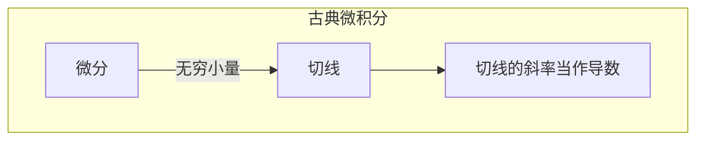
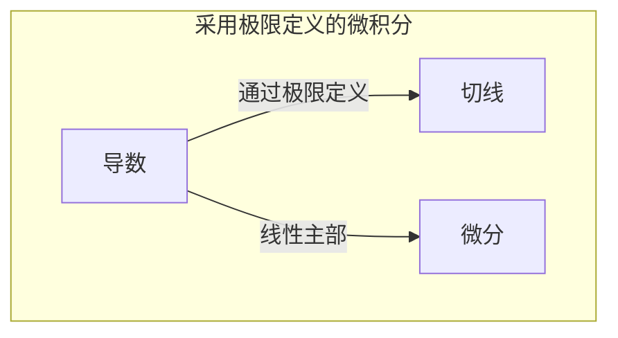

# 第一章 函数

[toc]

## 第一节 函数及其性质

### 1 什么是函数？

最开始的函数表述十分的随便。凡是曲线上点有关的量都叫函数，例如横纵坐标，长度等。

欧拉刚开始把函数定义为在纸上能一笔画成的曲线都可以叫做函数。

柯西把函数定义为每一个$x$的值，都有完全确定的$y$值与之对应。关于函数的定义才开始有了现在函数定义的雏形。再后来，狄历克雷注意到对应关系的问题，把函数的定义改为通过某种对应方式，对于$x$的值，使得有完全确定的$y$值与之对应。后来，随着集合论的兴起，又在集合论的基础上构建了现在的函数的定义。

### 2 表格表示对应方式

在生活中，我们经常会遇见各种各样的关系（事物是普遍联系的），比如，我和你们，你们和你们的名字等。一般最直接的方法就是把他按某种性质列出来，比如，我问你们班有多个女生，多少个男生。你们会怎么办？

| X    | 女生 | 男生 |
| ---- | :--: | ---- |
| Y    |  34  | 54   |

再比如我说第一排坐了三个学生，第二排坐了四个学生。

| X    | 1    | 2    |
| :--- | ---- | ---- |
| Y    | 3    | 4    |

以上的这两个表格是不是有种对应关系。那我们接下来来总结一下，以上表为例，第一行中是不是都表示一排，第二行表示坐在这的人数，那我们把第一排、第二排、、、、叫做一类，把每排坐的人数表示为一类。

大家先回忆一下在高中时学过的集合的概念，把上面的每一行中表述的一类做成一个集合。一般情况下，集合没有一个明确的定义，一般情况下，集合是一个或多个元素放在一起。顺便复习一下集合：集合与集合的关系描述方式有交、并和包含。元素与集合的关系有属于和不属于。

### 补充

#### 映射概念

设X,Y是两个非空集合，如果存在一个法则$f$,使得对X中每一个元素x,按法则$f$,在Y中有唯一的确定的元素$y$与之对应，那么称$f$为从X到Y的映射，记作：
                       $$f:X\rightarrow Y,$$
其中 $y$称为元素 $x$(在映射$f$下)的像,并记作$f(x)$,即$y=f\left(x\right)$, 而元素$x$称为元素$y$(在映射$f$)的一个原像;集合 $X$ 称为映射 $f$的定义域 ,记$D_f$,即$D_f=X$ ,$X$中所有元素的像所组成的集合称为映射f的值域,记作 $R_{f}$或 $f(X)$,即 $R_{f}=f(X)=\left\{f(x)|x\in X \right\}. $

设 ${f}$是从集合X到集合Y的映射,若$R=Y$,即Y中任一元素$y$都是$X$中某一元素的像,则称$f$为$X$到$Y$上的映射或满射;若对$X$中任意两个不同元素$x_1\neq x_2$,它们的像$f(x_1)\neq f(x_2)$,则称$f$为$X$到$Y$的单射;若映射$ f$ 既是单射,又是满射，则称广为一一映射（或双射)。

映射又称为算子.根据集合$X$、$Y$的不同情形,在不同的数学分支中，映射又有不同的惯用名称、例如,从非空集$X$到数集Y的映射又称为$X$上的泛函，从非空集$X$到它目身的映射又称为$X$上的变换。从实数集 (或其子集)$X$到实数集$Y$的映射通常称为定义在 ${X}$ 上的函数。

###### 定义1 设 ${\mathbf{}}D$ 与 ${M}$ 分别是两个非空实数集,若存在对应法则$f$，对于$D$中的每一个数 $x$，通过对应法则$f$,集合 $\textstyle{M}$ 中都有唯一确定的数图$y$与之对应,则称广为从$D$到${M}$的函数(也称为映射),记作:

$$
f:D\rightarrow M
$$

其中$D$称为函数$f$的定义域,$D$中的每一个 $x$ 根据对应法则$ {f}$对应于 一个$y$,记作$f(x)$,称为函数$f$在 $x$ 处的函数值,全体函数值的集合
$$
W=\{y\mid y=f(x)~,x\in{{D}}\}\subset{{M}}
$$
称为函数$f$的值域，$x$称为函数$f$的自变量，$y$称为因变量。

最好画个图，来说明值域包含在一个集合里面。

==提问== ==函数是由什么决定的？==

最重要的定义域和对应关系。因为我们知道定义域和对应关系，就可以求出值域了。

### 3 几种常见的定义域

大家在高中的时候学过的常见的数集有自然数集一般用**N**来表示，有理数集用**Q**(quotient)表示，整数集用**Z**来表述，**R**表示实数域。

### 4函数的表示法

#### 表格的方法：

对应法则$f:x+1$

|  $x$   |  1   |  2   |  3   |
| :----: | :--: | :--: | :--: |
| $f(x)$ |  2   |  3   |  4   |

#### 图像的方法：

假设一个乌龟沿一条直道爬行，每小时爬的速度为每小时2m,爬行一小时后，趴在那两个小时，然后接着以每小时两米的速度向前爬去。请画图做说明。

#### 公式法：

$$
\begin{equation}\label{c}
	f(x)=
	\begin{cases}
		1*x, &{x\in(0,2]},\\
		2,             &{x\in(2,4]},\\
		2*x,  &{x\in(4,5]},  
	\end{cases}
\end{equation}
$$

### 5.相同函数

#### （1） 相同定义域

|  $x$   |  -1  |  -2  |
| :----: | :--: | :--: |
| $f(x)$ |  1   |  4   |

大家可以看一下上面的函数可以用至少两种函数来表示：

1.$y=x+2$

2.$y=x^2$

#### （2） 相同对应关系

假设$f(x)=sin(x)$

|  $x$   | $\frac{\pi}{2}$ | $-\frac{\pi}{2}$ |
| :----: | --------------- | ---------------- |
| $f(x)$ | 1               | -1               |

|  $x$   | $-\frac{3\pi}{2}$ | $\frac{3\pi}{2}$ |
| :----: | ----------------- | ---------------- |
| $f(x)$ | 1                 | -1               |

上面表格中的两种对应关系表明函数值相等，并不能说明函数相同。

### 6介绍几种特殊的函数

1】分段函数

2】向上取整：$x$取一个不小于自身的最小整数

3】向下取整: $x$取一个不大于自身的最大整数

   同济版高等数学里面记为’取整函数‘，用$[]$表示。

4】符号函数:
$$
\begin{equation}
	sgn(x)=
	\begin{cases}
		-1, &{x<0},\\
		0,     &{x=0},\\
		1,&{x>0},
	\end{cases}
\end{equation}
$$

### 7.函数的几种特性

#### 1】有界性

存在正数$M$，对于任意的$x\in[a,b]$,都有$|f(x)|<M$。

#### 2]   单调性 

存在集合$D$包含于定义域，对于任意的$x_1,x_2\in D$,且 $x_1<x_2$,$f(x_1)<f(x_2)$。

在定义域内，单调增函数和单调减函数的统称为单调函数。

函数有单调性并不表示函数为单调函数。例如，反比例函数。

#### 3】奇偶性

如果$x$的定义域关于原点对称，如果函数满足$f(x)=f(-x)$,则称为偶函数，如果$f(x)=-f(-x)$,则称为函数为奇函数。

#### 4】 周期性

存在$T\neq0$，使得$x\in D $, $x+T\in D$, 使得$f(x)=f(x+T)$。

### 8 反函数

对于反函数就是会求反函数，因为在微积分中会有使用要求。

我们通过观察发现非空数集上D上的函数$y=f(x)$的值域为$A$，若对$A$中的任意$y$，有$y=f(x)$可以唯一确定的$x=\psi(y)$,则称$x=\psi(y)$为函数的反函数，记做：

​                 $x=f^{-1}(y)\qquad y\in A$ 

通过以上的定义，可以得到：

1】 函数的值域是反函数的定义域

2】函数的定义域是反函数的值域

3] 函数和反函数，从集合映射的角度上讲是一个一一对应（充要条件）

注，函数是单射，存在逆函数。是充分条件。

##### 反三角函数

反正弦函数 $y=arcsinx$

反余弦函数 $y=arccos x$

反正切函数 $y=arctanx$

反余切函数 $y=arccotx$

==扩展== ==单调函数和反函数的关系：==

###### 定理1   单调函数必有反函数，但有反函数不一定是单调函数。

## 第二节

### 一 基本初等函数

#### 1.常函数

$y =	C$

#### 2.幂函数

$y=x^u$

#### 3.指数函数

$y=a^x\qquad (a>0,a\ne1)$

#### 4.对数函数

$y=log_2x \qquad (a>0且 a\ne1)$

#### 5.三角函数

$y=sin(x)$等

#### 6.反三角函数

$y=arcsin(x)$等

### 二  四则运算

简单的对幂函数和指数函数的进行相加或相减，称为简单函数。

$f(x)+g(x)$

用集合的图来画一下，说明函数是可以相加的。

|   X    |  1   | 2    |
| :----: | :--: | ---- |
| $f(x)$ |  4   | 5    |

|   X    |  4   |  2   |  1   |
| :----: | :--: | :--: | :--: |
| $g(x)$ |  6   |  2   |  3   |

那么，这种情况怎么相加呐？

比如，一班的同学组成学习小组，二个人一组的有五组，一个人一组的有四组。二班的学习小组有二人组成的小组有2组，4个人做成的小组有6个组，一个人一组的有三组。我问：这两个班分组相同的一共有几个？

大家可以看到对于表二中的四人一组，没起作用，是因为第一个班没有四人分组的。（这个例子不好）

设函数$f(x)$,$g(x)$的定义域为$D_f$,$D_g$, $D=D_f\cap D_g \ne \empty$，则我们可以定义这两个函数的下列运算：

==和（差）$f+g$:==                ==$(f+g)(x)=f(x)+g(x)$==

==积$(f \cdot g)(x)$==：                  ==$f(x)\cdot g(x)$==     

==商 $(\frac{g}{f})(x)$==                    ==$(\frac{g}{f})(x)=\frac{f(x)}{g(x)},x\in D/\{x\arrowvert g(x)=0,x \in D\}$==  

### 三 复合函数

我们尽量用简单的表格来表示，当然用集合表示也是非常方便的。

用集合表示一个对应：

|   X    |  1   |  2   |  4   |
| :----: | :--: | :--: | :--: |
| $f(x)$ |  5   |  6   |  7   |

再来看另一个对应：

| $f(x)$ | 5    | 6    | 7    |
| :----: | ---- | ---- | ---- |
|  $Y$   | 12   | 23   | 34   |

大家可以看到，我们对第一个的对应关系生成的值域，可以作为第二个对应关系的定义域。对于这种关系我们下个定义来描述一下：

**复合函数的概念可如下表述:**

设函数$y =f(u)$的定义域为$D_f$,函数$u=g(x)$的定义域为$D_g$,且其值域 $R_g\subset D_f$,则由下式确定

$$
y=f[\:g(x)\:]\:,\quad x\in D_{_g}
$$

称为由函数$u=g(x)$与函数$y=f(u)$构成的复合函数,它的定义域为$D$,变量$u$称为中间变量。

大家还是要注意一下定义域的问题。以下面表格举例：

| X    | 1    | 3    | 5    |
| ---- | ---- | ---- | ---- |
| Y    | 2    | 4    | 6    |

如果存在一个形如函数的表达式如下：
$$
F(Y(X))\text{且F的列表如下：}
$$

| Y    | 4    | 6    |
| ---- | ---- | ---- |
| F    | 2    | 1    |

大家可以观测这种对应关系，并不构成函数的定义，因为第二个表中的自变量6并不是上一个函数的值域中的值。

大家可以做道题，体会一下。
$$

$$

$$
f(x)=x^2,\qquad g(x)=x^3\\
f(x)\cdot g(x)=x^5\\
f(g(x))=x^6
$$

### 四 初等函数

由常数和基本初等函数经过有限次的四则运算和有限次的函数复合步骤所构成的可以用式子标识出来的函数，称为初等函数。

        

# 第二章 极限与连续

## 第一节 极限的定义

本节的目的是了解函数和数列的极限，进一步了解无穷大和无穷小的一些概念。

### 1】数列的极限

有棋盘和大米的故事：相传印度有位外来的大臣跟国王下棋，国王输了，就答应满足他一个要求：在棋盘上放米粒。第一格放1粒，第二格放2粒，然后是4粒，8粒，16粒…直到放到64格。国王哈哈大笑，认为他很傻，以为只要这么一点米。 按照大臣的要求，放满64个格，这些米别说倾空国库，就是整个印度，甚至全世界的米，都无法满足这个大臣的要求！
$$
1,2^1,2^2,2^3,\cdot\cdot\cdot,2^n,\cdot\cdot\cdot
$$

庄子的一句话：**一尺之棰，日取其半，万世不竭。**
$$
\frac{1}{2}, \frac{1}{2^2},\frac{1}{2^3},\cdot\cdot\cdot,\frac{1}{2^n},\cdot\cdot\cdot
$$
*如今用马克思的哲学来看，这句话是错的，犯了唯心主义。*（不太确定）

芝诺效应乌龟：阿基里斯追前面的一只乌龟，阿基里斯的速度大于乌龟的速度。初始时乌龟处于$A1$处，等阿基里斯跑到$A1$处时，乌龟已经爬到$A2$处了；当阿基里斯再赶到$A2$处时，乌龟已经爬到$A3$处了......虽然每次追赶的距离越来越小，但是这个过程却是可以永远的进行下去的，因此阿基里斯永远追不上乌龟。

上面的符合一定规律的都叫做数列。但我们也只是感性的认识了一下数列。针对形如上面的一串数的表示方法，我们给函数下一个数列的定义。

**定义1**

  如果按照某一法则，对每一个$n\in N_+$,对应着一个确定的实数$x_n$,实数$x_n$按照下表，从小到大排列成一个序列：
$$
x_1,x_2,x_3,\cdot\cdot\cdot,x_n,\cdot\cdot\cdot
$$
就叫做数列，$x_n$称为它的通项。

注：其实就是在实数域按某种规则取数，第一个叫做$x_1$,第二个叫$x_2$,如此类推。（其实上面的数列的定义也是一种函数的表达）

为了加深大家的印象，再取几个数列：
$$
u_n=2n+1\\
u_n=(-1)^n\\
u_n=\frac{n}{n+1}
$$
大家可以观察一下上面的这五个数列，当$n$越来越大的时候，会有什么情况。我们当然希望能研究一些性质很好的数列，就是那些$n$越来越大，会变得越来越接近的一个确定的值。

大家请看定义7，这本书的定义7只能说大致的概括了极限的定义。

###### **定义2** 对于某个数列$\{u_n\}$,如果当$n$无限增大时，通项$u_n$无限接近域某个确定的常数$A$,则称常数$A$为数列$\{u_n\}$的极限，或称数列$\{u_n\}$收敛于$A$，记作 $lim_{n\rightarrow\infty}{u_n}=A\text{或} u_n\rightarrow A$

这个定义说的比较笼统，有两个问题：

   1.无限接近有多接近

   2 $n$无限增大增大到什么程度

  同济版的高等代数有相对现代数学的定义，请看如下：

###### ***定义3***      任意的数列 $a_n$ ,存在常数 $a$, 对于$\forall \epsilon>0,\exists N>0$, 使得当$n>N$时,$|a_n-a|<\epsilon$, 则称数列$a_n$的极限是 $a$ 或 数列$a_n$ 收敛于$a$。

上面数列定义的集合意义是什么？

大家可以想想一条线，那么实数$a$一定可以用上面的一个确定的点表示，在$a$的附近$\epsilon$的范围会包含$N$之后的所有项。

给大家一个例子证明一下$\frac{1}{n}$的极限为0.

证： 对任意的$\epsilon>0$,为使$|1 /n -0|=1/{n}<\epsilon$,只需$n>1/\epsilon$,取 $N=[1/\epsilon]+$ 1,则当 ${n}>{N}$ 时,有 $|1/n-0|< 1/n < 1/N <\epsilon $。据数列极限的定义,得证。

那么接下来会问什么样的数列可以取到极限呢？

我们考虑一种特殊的数列可以取到极限。

考虑$\frac{3n+1}{2n+3}$,大家可以观察一下，当$n$取到很大的数时，会发生什么?

这个数列会随着$n$变大会变大吗? 大家可以用高中时候的比较法看看。比如说写成$\frac{3n+1}{2n+3}<1$,或者$\frac{3n+1}{2n+3}<2$诸如此类。大家很容易会发现，无论这个函数如何取都会小于2.有界性，就像第一章中的性质。那大家再看看退回一下，你们时如何判断它小于2？有一种方法很直接，高中常用，后一项减去前一项做差，来看数列是不是增大或减小，帮助自己做判断，大家可以可以自己减一下试一试。

我们直接说结论：**（单调有界定理）在实数域中，单调有界数列必有极限。**

关于这个结论，大家需要记住且会识别单调有界数列。定理的证明需要用到确界原理或者实数的一些定理。

**推广：**

(**致密性定理**) 任何有界数列必定有收敛的子列。

任何数列都存在单调子列。

### 2】数列极限的性质

(**有界性**) 若数列 $\mid a_{n}\mid$ 收敛,则 $\textstyle{a_{n}}$ 为有界数列,即存在正数 ${\cal{M}}.$ 使得对一切正整数 ${\boldsymbol{n}}\ .$ 都有

$$
\mid a_{i}\mid\,\leq\,M.
$$
(**唯一性**) 若数列 $\{a_n\}$ 收敛,则它只有一个极限.

(**保号性**) 若$\operatorname*{lim}_{n\to\infty}a_{n}=a>0\left(a<0\right)$ , 那么存在正数 ${N}$ ,使得当 $\scriptstyle n>N$ 时,有 $a_{n}>0 \quad (a_{n}<0) $ .

**推论** 如果数列 $ \{x_{n}\}$ 从某项起有 $x_{n}\geq0$ (或 $x\leq0$ ),且 $\operatorname*{lim}_{n\to\infty}x_{n}=a$ ,那么 $a\geq0$ (或 $ a\leq0$).

保号性和它的推论并不是严格的充分必要条件，比如$(-1)^n\frac{1}{n}$,利用这个证明，极限为0，那么就不能用定理做判断，但推论满足。

**夹逼定理：**

如果数列 $\textstyle{\left\{x_{n}\right\},\left\{y_{n}\right\}}$ 及 $ \{z_n\} $ 满足下列条件: 

(1)从某项起, $\exists n_{0}\in\mathbf{N_+},$ ,当 $n>n_{0}$ 时,有
$$
y_{_{n}}\leq x_{_{n}}\leq z_{_{n}}\,;
$$
(2)$lim_{n\rightarrow\infty} y_n=a$ $\operatorname*{lim}_{n\to\infty}z_{n}=a$ 
那么数列 $ \lbrace\,x_{_{n}}\, \rbrace$ 的极限存在,且 $\operatorname*{lim}_{n\to\infty}x_{n}=a.$ 

数列也可以这样定义：自变量为正整数的函数，$u_n=f(n)$,其函数按自变量$n$从小到大排列成一列数,$$u_1,u_2,u_3,\cdot\cdot\cdot,u_n,\cdot\cdot\cdot$$,$u_n$称为它的通项。

例如：
$$
\frac{1}{n^2}\\
\frac{1}{n^4}\\
\frac{1}{n^3}
$$

$$
lim_{n \rightarrow \infty}\frac{1}{n^2}=0\\
lim_{n \rightarrow \infty}\frac{1}{n^4}=0\\
lim_{n \rightarrow \infty}\frac{1}{n^3}=0
$$

$$
\text{例如，求极限}lim_{n \rightarrow \infty}\frac{3n+1}{2n+3}\\

\frac{3n}{2n+3}=\frac{3n+6-6}{2n+3}=\frac{3}{2}-\frac{6}{2n+3}\\

\frac{3n+1}{2n}=\frac{3}{2}+\frac{1}{2n}\\
$$

### 3】函数的极限

**在自变量的某个变化过程中，如果对应的函数值无限接近于某个确定的数，那么这个数就叫做变化过程中函数的极限。**

**需要特别申明：要注意$lim_{x\rightarrow x_0}f(x)$和$f(x_0)$**

设 $a\cdot b\in\mathbb{R}，\text{且} a<b.$ 我们称数集 $\{x\mid a<x<b\}$ 为**开区间**,记作 $(\ a\ ,b)$ ;数集 $\{ x\mid a\leq x\leq  $b\}称为**闭区间**,记作 $[a,b]$ ;数集 $\{x\mid a\leq x<b\}$ 和 $\{x\mid a<x\leq b\}$ 都称为**半开半闭区间**,分别记作 $[a,b)$ 和 (a,b].$ 以上这几类区间统称为有限区间.从数轴上来看,开区间 $(a ,b)$ 表示 $a,b$ 两点间所有点的集合,闭区间 $a,b$ 比开区间 $(a,b)$ 多两个端点,半开半闭区间 $[a,b)$ 比开区间 $(a,b)$ 多一个端点 $a等.

设 $a\in\mathbb{R},\delta>0,$ 满足绝对值不等式 $|x-a\mid<\delta$ 的全体实数$x$的集合称为点$a$的$\delta$邻域,记作 $U(a;\delta)$ ,或简单地写作 $U({{{a}}})$ ,即有

$$
U(\,a\,;\delta)\,=\{ x\mid\ \mid x\,-\,a\mid\ \ <\,\delta\} =\,(\,a\,-\,\delta\,,a\,+\,\delta\,)\,.
$$
**点 $a$的空心$\delta$ 邻域**定义为
$$
U^{o}(\ a\,;\delta)\,=\{x\mid0\,<\,\mid x\,-\,a\mid\ <\,\delta\}.
$$
它也可简单地记作 $U^{o}(\ a)$ 注意, $U^{o}(\,a\,;\delta)$ 与 $U(\,a\,;\delta)$ 的差别在于: $U^{o}(\,a\,;\delta\,)$ 不包含点$a$.此外,我们还常用到以下几种邻域，
   **点$a$的$\delta$右邻域**   $U_{+}(a\;\delta)=[a\;,a\!+\!\delta)\nonumber$ ,简记为 $U_{+}(\,a\,)$ 。
   **点a的$\delta $左邻域**   $U_{-}(\,a\,;\delta\,)=\left(\,a-\delta\,,a\,\right]$ ,简记为 $U_{-}(\,a\,)$ 。

###### ***定义4*** 设函数 ${f(x)}$ 在点 ${x}_{0}$ 的某一去心邻域内有定义.如果存在常数 $A$,对于任意给定的正数$\epsilon$（不论它多么小),总存在正数 $\delta$,使得当 ${x}$ 满足不等式 

$0<|x -x_0|<\delta$ 时,对应的函数值 $f(x)$ 都满足不等式
$$
|f(\,x\,)-A\,|<\varepsilon\,
$$
那么常数$A$就叫做函数 $ f(x)$ 当 $x{\longrightarrow}x_{0}$ 时的极限,记作
 $\operatorname*{lim}_{x\to x_{0}}=A$ 或$f(x)\rightarrow A$表示 $x\neq x_{0}$ .$(\text{当}x\longrightarrow x_{0})$
可以简单地表述为$\operatorname*{lim}_{x\to x_{0}}f(x)=A\Leftrightarrow$ $\forall \epsilon>0,\exist \delta>0,当 $$0< |x-x_0|<\delta$，

​                     $ |f(x)-A|<\epsilon.$ 

###### **单侧极限**

上述 $x{\longrightarrow}x_{0}$ 时函数 $f(\ x)$ 的极限概念中 $x $是既从${{x}}_{0}$ 的左侧也从 $x_0$的右侧趋于 $x_0$ 的。但有时只能或只需考虑 $x$仅从 $x_0$ 的左侧趋于 $x_0$ (记作 $x \rightarrow x_{0}^-$ )的情形, 或$x$仅从 ${{x}}_{0}$ 的右侧趋于 $x_0$ (记作 $x{{\rightarrow}}x_{0}^{+}$ 的情形）。在 $x\rightarrow x_{0}^-$ 的情形,$x$在 $x_0$ 的左侧,$x<x_0$ 。在 $\operatorname*{lim}_{x\to x_{0}}\!\!f(x)=A$ 的定义中,把 $0<\mid x-x_{n}\mid<\delta$ 改为 $x_{0}-\delta<x<x_{0}$ ,那么 ${{A}}$ 就叫做函数 $\textstyle f(x)$ 当 $x{\longrightarrow}x_{0}$ 时的左极限,记作
           $$lim_{x\rightarrow x_0^-}f(x)=A \qquad\text{或} \qquad f(x_0^-)=A$$.

类似地,在 $\operatorname*{lim}_{x\to x_{0}+}=A$ 的定义中,把 $0< |x-x _0|<\delta $改为 $x_{0}<x<x_{0}+\delta\,,$ 那么$A$就叫做函数 $f(\ x)$ 当 $x\longrightarrow x_{0}$ 时的右极限,记作
$$
\operatorname*{lim}_{x\to x_{0}^+}\!\!f(\,x\,)=A\:\:\:\:\:\:\text{或} f(x_0^+）=A
$$
左极限与右极限统称为单侧极限。

**例1** 设 $f(\;x)\;=\;\left\{\begin{array}{l l}{{-x\;,}}&{{x<0\;,}}\\ {{1\;,}}&{{x=0\;,}}\\ {{x\;,}}&{{x>0\;,}}\end{array}\right.$ 画出该函数的图形,求$lim_{x\to0^-}f(x)$,$lim_{x\to0^+}f(x)$,并讨论$lim_{x\to0}f(x)$是否存在。

解：$f(x)$的图像如图所示,由该图不难看出:
$$
lim_{x\to0^-}f(x)=lim_{x\to0\and x<0}f(x)=lim_{x\to0\and x<0}(-x)=0\\
lim_{x\to0^+}f(x)=lim_{x\to0\and x>0}f(x)=lim_{x\to0\and x>0}(x)=0\\
lim_{x\to0}f(x)=0
$$
**例2**设 $sgn x=\left\{{\begin{array}{l l}{-1,}&{x<0\,,}\\ {0,}&{x=0\,,}\\ {1,}&{x>0.}\end{array}}\right.$ 画图讨论 $lim_{x\to0^-}sgn x,lim _{x\to0^+}sgn x,lim_{x\to0}sgn x $是否存在.

解 函数$sgnx$的图形,不难看出:
$$
lim_{x\to0^-}sgn(x)=lim_{x\to0\and x<0}sgn(x)=lim_{x\to0\and x<0}-1=-1\\
lim_{x\to0^+}sgn(x)=lim_{x\to0\and x>0}sgn(x)=lim_{x\to0\and x>0}1=1\\
lim_{x\to0}sgn(x)=不存在
$$

==极限存在与左右极的关系：==

**定理2** $\operatorname*{lim}_{x\to x_{0}}f(x)=A$ 的充要条件是 $\operatorname*{lim}_{x\to x_{0^+}}f(x)=\operatorname*{lim}_{x\to x_{0}^{-}}f(x)=A.$ 

#### 例题

1.因为函数$f(x)$在$x_0$处有定义，所以$lim_{x\to x_0}f(x)$存在。

2.因为函数$f(x)$在$x_0$处没有定义，所以$lim_{x\to x_0}f(x)$不存在。

##### 顺便明确一下无穷大和无界的区别：

无穷大必无界，但无界不一定无穷大。比如$lim_{x\to \infty}xcosx$是无界函数，但不是无穷大。还有就是$lim_{x\to 0}\frac{1}{x}sin\frac{1}{x}$。

###### ***定义5***      设函数 $f({\boldsymbol{x}})$ 当$|X|$大于某一正数时有定义.如果存在常数 $A$ ,对于任意给定的正数$\epsilon$(不论它多 $\epsilon$ 么小),总存在着正数 $X$ ,使得当满足不等式 $|x|>X$时,对应的函数值 $f({\boldsymbol{x}})$ 都满足不等式

$$
|f(x)-A|<\epsilon
$$

那么常数 $A$就叫做函数$f( x)$当 $X\longrightarrow\infty$ 时的极限,记作
                                    $ lim_{x\rightarrow\infty}f(x)=A$或 $f(x){\overset{}{\longrightarrow}}A$ (当$x\rightarrow \infty$) 

可简单地表达为 $\operatorname*{lim}_{x\to \infty}f(\ x)=A\Leftrightarrow\forall\ \epsilon>0$ ,$\exists X>0$ ,当 $x>X$ 时,有 $|f(x)-A|<\epsilon.$   

### 4】函数极限的性质

(**函数极限的唯一性**) 如果 $\operatorname*{lim}_{x\to x_{0}}f(x)$ 存在,那么这极限唯一。
   (**函数极限的局部有界性**) 如果 $\operatorname*{lim}_{x\to x_{0}}f(x) =A$ 那么存在常数 $M>0$ 和$\delta>0$,使得当 $0<\vert x-x_{n}\vert <\delta$时,有 $|f(x)\mid\leq M$。

(**函数极限的局部保号性**) 如果 $\operatorname*{lim}_{x\to x_{0}}f(x)=A$ ,且$A>0$(或$A<0$),那么存在常数 $\delta$,使得当 $0<\mid x-x_{0}\mid<\delta$ 时,有 $f(x)>0$ (或 $f(x)<0$ )。

**推论** 如果在 ${\boldsymbol{x}}_{0}$ 的某去心邻域内 $f(x)\geq0$ (或 $f(x)\leq0),而且 $$lim_{x\rightarrow x_{0}}f(x)=A$ ,那么$A\leq0$.

**夹逼准则**

若$x\in U^{o}(x_0;\delta)$,其中$\delta$为某个正常数，有
$$
g(x)\leq f(x)\leq h(x)\\
lim_{x\rightarrow x_0}g(x)=lim_{x\rightarrow x_0}h(x)=A\\
\text{则}lim_{x\rightarrow x_0}f(x)=A
$$

$$
lim_{n\to \infty}\frac{1}{n+1}=\\
lim_{n\to \infty}\frac{1}{n^2}=\\
lim_{x\to \infty}{x^2+1}=\\
lim_{x\to \infty}\frac{1}{x^2+1}=\\
lim_{n\to \infty}cosx=\\
lim_{x\to \infty}x cosx=\\
lim_{n\to x_0}a^x=\\
lim_{n\to x_0}sinx=\\
lim_{x\to \frac{\pi}{2}}cosx=\\
lim_{n\to 8}\sqrt[3]{x}=\\
lim_{x\to \frac{\pi}{4}}tanx=\\
lim_{x\to e}lnx=\\ 
lim_{x\to 0 }sinxcos\frac{1}{x}=lim_{x\to 0}sinx lim_{x\to 0}\frac{1}{cosx }=0 lim_{x\to 0}cos\frac{1}{x}=0\\
lim_{x\to 2}\frac{x^2}{x-2}=\frac{lim_{x\to 2}x^2}{lim_{x\to 2}(2-x)}=\infty\\
$$

### 5】无穷小

如果函数$f(x)$当$x\to x_0$或$x\to \infty$时极限为$0$那么称函数$f(x)$i当$x\to x_0$(或$x\to \infty$)时的无穷小。大家首先要学会认识什么是无穷小，函数什么情况下，取到无穷小。

无穷小就是函数的极限为零。以一下的函数为例，函数什么时候会取到无穷小。

$y=\frac{1}{x}$,$y=2^x$

最好是函数与图相结合的时候，先大致的想一想，函数会是怎么样，再去重点看那些地方会出现无穷小。下面咱们换一种方式来看无穷小。如果把无穷小换一下方式来理解概念的话，可以写成下面这样。如果$lim_{x\to x_0}f(x)=0$,当$x\to x_0$时，函数$f(x)$是一个无穷小。那么根据$$f(x)$$在$x_0$处极限的定义，我们就说$f(x)$在$x_0$的一个$\delta$邻域内，$|f(x)|<\epsilon$表明$f(x)$为一个任意小的值。

会有如下的定义：

在自变量的同一变化的过程中$x\to x_0$($x\to \infty$)中函数$$f(x)$$具有极限A的充分条件是$f(x)=A+a$(a为无穷小)

大家可以看看书上的例题，大家可以做一做$\frac{x+1}{x-1}$刚开始看到这个题的时候，大家也许会觉得问$x=1$会怎么样。大家一定要关注无穷小的极限为0，不用取关心$x=1$的情况。这里的题出成这样的形式是为了帮助大家理解这个无穷小。

无穷小的运算性质：

1】两个无穷小的和是无穷小

2】有界函数与无穷小的乘积是无穷小

3】常数与无穷小的乘积是无穷小

4】有限个无穷小的乘积是无穷小

5】无限个无穷小的和不一定是无穷小

6】无限个无穷小的乘积不一定是无穷小

### 6】无穷大

如果函数在$x_0$的某一邻域内有定义，（或在$$x$$大于某一正数时有定义）。对于任意给定的正数$M$

,总存在正数$\delta$ (或正数X),只要x适合不等式$0<|x-x_0|>\delta$($|x|>X$),对于函数值总满足	$|f(x)|>M$,那么乘函数$f(x)$是	$x\to x_0$(或 ($x\to \infty$))时无穷大。

大家接下来来看$\frac{x+1}{x-1}$的无限大问题。

无穷大和无穷小的关系：在自变量的同一变化过程中，如果函数4$f(x)$为无穷大，那么$\frac{1}{f(x)}$

为无穷小，反之，如果$f(x)$为无穷小，且$f(x)\neq0$,那么$\frac{1}{f(x)}$为无穷大。做几道题验证一下。

#### **==补充  无穷大和无界的关系==**

无穷大必是无界，无界不一定无穷大。

例如；$lim_{x\to \infty}xcosx$是无界函数，但不一定是无穷大

### 7】无穷小的比较

在刚刚的介绍中，我们介绍了两个无穷小的加减乘还是无穷小，但两个 无穷小的相处不一定还是无穷小。为了大家有一个直观的印象，大家看到下面的题会有什么直观的想法呐？

$$
lim_{x\to0}\frac{3x}{5x}\\
lim_{x\to 0}\frac{x}{x^2}\\
lim_{x\to 0}\frac{x^2}{x}\\
$$
d定义2 设某一极限的过程中，$\alpha$与$\beta$都是无穷小，且$lim\frac{\alpha}{\beta}=C$(C为常数)，会出现几种不同的情况。

1】$C=0$则称是$\alpha$比$\beta$高阶的无穷小,记做$\alpha=o(\beta)$

2】若$C\neq0$,$\beta$和$\alpha$是同阶无穷小，并且当$C=1$,称为等价无穷小，记做‘$\alpha\sim\beta$’

等价无穷小还有中类似传递的性质

定理 设$\alpha$ $\sim \widetilde{\alpha}$,$\beta$$\sim \widetilde{\beta}$

1】$lim\frac{\widetilde \alpha}{\widetilde \beta}$存在，则$lim\frac{\alpha}{ \beta}$

2】$lim\frac{\widetilde \alpha}{\widetilde \beta}=\infty$，则$lim\frac{\alpha}{ \beta}=\infty$

常见的几种无穷小替换：
$$
sinx \sim x   \qquad tanx\sim x\\
arcsinx \sim x\qquad arctanx\sim x\\
1-cosx\sim \frac{x^2}{2}\qquad ln(1+x)\sim x\\
e^x-1\sim x\qquad \sqrt{1+x}-1\sim \frac{x}{2}
$$

### 8】两个重要极限

（1）$lim _{x\to0}\frac{x}{sinx}=1$

(2)  $lim _{x\to0}\frac{sinx}{x}=1$

证明：用圆和三角形的面积进行夹逼证明。

例6求 ${lim}_{x\to0}{\frac{\sin3x}{\sin4x}}$ 
    解 $\operatorname*{lim}_{x\to0}{\frac{\sin3x}{\sin4x}}=\operatorname*{lim}_{x\to0}\left({\frac{\sin3x}{3x}}\cdot{\frac{4x}{\sin4x}}\cdot{\frac{3x}{4x}}\right)$ 

例7求 $\operatorname*{lim}_{x\to0}{\frac{1-\cos\,x}{x^{2}}}.$ 
解
$$
\operatorname*{lim}_{x arrow0}{\frac{1-\cos\,x}{x^{2}}}=\operatorname*{lim}_{x arrow0}{\frac{2\sin^{2}{\frac{x}{2}}}{x^{2}}}={\frac{1}{2}}(\operatorname*{lim}_{x\rightarrow 0}{\frac{\sin{\frac{x}{2}}}{\frac{x}{2}}} )^{2}={\frac{1}{2}}.
$$
例8求 $\operatorname*{lim}_{x\to0}{\frac{\tan{x}-\sin{x}}{x^{3}}}.$ 
解 $\operatorname*{lim}_{x\to0}{\frac{\tan\,x-\sin\,x}{x^{3}}}=\operatorname*{lim}_{x\to0}{\frac{\tan\,x\left(\,1-\cos\,x\right)}{x^{3}}}$ 
由例7知 ${\frac{1-\cos\,x}{x^{2}}}\to{\frac{1}{2}}{\mathrm{~}}\left(x\to0\right)$ 故 $\operatorname*{lim}_{x\to0}{\frac{\tan\,\,x-\sin\,x}{x^{3}}}={\frac{1}{2}}.$ 

(1) $\operatorname*{lim}_{x\to0}x^{2}\sin{\frac{1}{x^{2}}}$ 

(2)$lim_{x\to \infty}{\frac{1}{x}}arctanx $ 

(3) $lim_{x\to \infty} \frac{sin x+cosx}{x}$

(3)  $lim_{x\to \infty}(1+\frac{1}{x})^x=e$

(4)  $lim_{x\to \infty}(1+x)^\frac{1}{x}=e$

证明： 用单调有界函数必有极限证明。 

例9求 $\operatorname*{lim}_{x\to \infty}\left(1\;+\;{\frac{3}{x}}\right)^{x}.$ 
解 令 ${\frac{x}{3}}=u$ 则 $x=3u.$ 
$$
\operatorname*{lim}_{x\to \infty}\left(1+{\frac{3}{x}}\right)^{x}\ =\operatorname*{lim}_{u\to \infty}\left(1+{\frac{1}{u}}\right)^{3u}=\operatorname*{lim}_{u\to \infty}\left[\left(1+{\frac{1}{u}}\right)^{u}\right]^{3}=e^{3},
$$
例10求 $\operatorname*{lim}_{x \rightarrow \infty}\left(1-\frac{2}{x}\right)^{x}.$ 
解 
$$
\operatorname*{lim}_{x\to \infty}\left(1-{\frac{2}{x}}\right)^{x}=\operatorname*{lim}_{x\to \infty}\left[\left(1+{\frac{1}{-{\frac{x}{2}}}}\right)^{-{\frac{x}{2}}}\right]^{-2}=\mathbf{e}^{-2}.
$$
例11求 $\operatorname*{lim}_{x\to x}\left({\frac{2-x}{3-x}}\right)^{x}.$ 
 ${\frac{2-x}{3-x}}=1\,+\,{\frac{1}{u}}\,,$ 解得 $x=u+3.$
$$
\operatorname*{lim}_{x\to \infty}\left({\frac{2-x}{3-x}}\right)^{x}\ =\operatorname*{lim}_{u\to \infty}\left(1\,+\,{\frac{1}{u}}\right)^{u}\ =\operatorname*{lim}_{u\to \infty}\left(1~+\,{\frac{1}{u}}\right)^{u}\cdot\operatorname*{lim}_{u\to \infty}\left(1~+\,{\frac{1}{u}}\right)^{3}\ =\mathbf{e}.
$$

$$
lim_{x\to +\infty}2^xsin\frac{1}{2^{x}}\\
lim_{x\to \infty} xtan\frac{1}{x}\\
\operatorname*{lim}_{x\to1}{\frac{\sin^{2}\left(x-1\right)}{x-1}}\\
\operatorname*{lim}_{x \rightarrow 0}\left(\,1-2x\,\right)^{\frac{1}{x}}\\
\operatorname*{lim}_{x\to\infty}\left(\,1\,+\,{\frac{2}{x}}\,\right)^{x+2} \\
{lim}_{x\to\infty}\left({\frac{2x-1}{2x+1}}\right)^{x+1}
$$

## 第二节 极限的运算

### 1】函数极限的运算法则

设$x$在同一变化的过程中，$\lim f(x)$及$\lim g(x)$都存在：

$$
\lim[f(x)\pm g(x)]=\lim f(x)+\lim g(x)\\
\lim[f(x)\cdot g(x)]=\lim f(x)+\lim g(x)\\
\lim\frac{f(x)}{g(x)}=\frac{\lim f(x)}{\lim g(x)}(\lim g(x)\neq 0且g(x)\neq 0)
$$
几个推论：

$$\lim f(x)$$存在，而$c$为常数，那$\lim[cf(x)]=c\lim[f(x)]$

如果$limf(x)$存在，而$n$为正整数，那么$lim[f(x)]^n=[limf(x)]^n$

### 2】数列极限的运算法则

对于数列

$lim_{n\to \infty}x_n=A$,$lim_{n\to \infty}y_n=B$，那么

（1）$lim_{n\to \infty}x_n\pm y_n=A\pm B$

(2)$lim_{n\to \infty}x_n\cdot y_n=A\cdot B$

(3)当$y_n\neq0(n=1.2.3\cdot\cdot\cdot)且B\neq0$,$lim_{n\to \infty}\frac{x_n}{y_n}=\frac{	A}{B}$

,再考虑一类特殊的函数的极限问题。

有理整函数 ：变量$x$和数域$R$上的数，经过有限次加减乘运算得到的函数表达式，一般写为$y=a_nx^n+a_{n-1}x^{n-1}+\cdot\cdot\cdot+a_0$

设多项式的$f(x)=a_nx^n+a_{n-1}x^{n-1}+\cdot\cdot\cdot+a_0$

则函数
$$
lim f(x)&=lim_{x\to x_0}(a_nx^n+a_{n-1}x^{n-1}+\cdot\cdot\cdot+a_0)\\
&=a_n(lim_{x\to x_0}x)^n+\cdot\cdot\cdot+a_0\\
&=a_nx_0^n+a_{n-1}x^{n-1}+\cdot\cdot\cdot+a_0\\
&=f(x_0)
$$

有理分式整函数

两个多项式的商，又称有理函数（就是分子分母都是多项式的函数）
$$
F(x)=\frac{P(x)}{Q(x)}
$$
其中$P(x)$和$R(x)$都是多项式。

我们讲函数的极限时，分成了当$x\to x_0$和$x \to \infty $两部分讲，我们也分两种情况来看有理函数的极限.

于是$lim_{x\to x_0}P(x)=P(x_0)$和$lim_{x\to x_0}Q(x)=Q(x_0)$

如果$Q(x)\neq 0$,那么$lim_{x\to x_0}F(x)=\lim_{x\to x_0}\frac{P(x)}{Q(x)}=\frac{lim _{x\to x_0}P(x)}{lim _{x\to x_0}Q(x)}=\frac{P(x_0)}{Q(x_0)}=F(x_0)$

例：
$$
lim_{x\to x_0}\frac{x^3}{x^2-5x+3}\\
lim_{x\to1}\frac{x-1}{x+1}\\
lmi_{x\to 1}\frac{x^2-1}{x-1}
$$

当$x\to \infty$ 时，函数的极限值分为三种情况：
$$
lim_{x\to \infty }\frac{a_0x^m+a_1x^{m-1}+\cdot\cdot\cdot+a_m}{b_0x^n+b_1x^{n-1}+\cdot\cdot\cdot+b^n}=
\left\{{\begin{array}{l l}{-0,}&{当m<n\,,}\\ {\frac{a_0}{b_0},}&{m=n\,,}\\ {\infty,}&{m>n.}\end{array}}\right.
$$

$$
lim_{x\to \infty}\frac{3x^3+3x^2+2}{7x^3+5x^2+4}\\
lim_{x\to \infty}\frac{3x^2-2x+2}{2x^2-x^2+4}\\
lim_{x\to \infty}\frac{2x^3-x^2+2}{3x^3-2x+4}
$$

## 第三节 连续函数

大节可以想象一下，如果所有的函数都可以像变革那样列举出来，那么，就不需要发展函数这个概念了，大家最常遇到的应该是图像那种表示法所表示的函数。描述一种$X$轴所对应的一一对应的关系。我们没有办法穷举出来的情况。

一般在图像表现出来的函数，最常见的一类时用连续函数来描述的。

$\Delta x$表示自变量$x$的一个增量。$\Delta y$表示函数$f(x)$的增量。（即$\Delta y=f(x+\Delta x)-f(x)$

定义1 设函数$y=f(x)$在点$x_0$的某一邻域有定义，如果
$$
lim_{\Delta x \to 0}\Delta y=limf(x_0+\Delta x)-f(x_0)=0
$$
那么称函数$f(x)=y$在点$x_0$连续。

**定义2.7.1**：设$f:[a,b]\rightarrow R$，我们称函数$f$在点$x_0\in (a,b)$连续，如果
$$
\lim_{x\rightarrow x_0}f(x)=f(x_0)
$$
也就是说，对任意给定的$\epsilon >0$，存在一个适当的$\delta >0$，使得当$|x-x_0|<\delta$时，有
$$
|f(x) - f(x_0)|<\epsilon
$$

存在处处不连续的函数（如Dirichlet函数），也存在只在一点连续的函数。

当$x$为有理数时$f (x)=1$,当$x$为无理数时$f (x)=0$, 显然这函数处处不连续. 那么我们对其做一点修改,就可以满足只在一点连续了,改法为: 当$x$为有理数时$f (x)=x-a$,当$x$为无理数时$f (x)=0$, 其中$a$为有理数. 那么$f (x)$就只在$a$点连续了.

如果$f(x_0+)=f(x_0)$，则函数在$x_0$处**右连续**，($lim_{x\to {x_0^-}}f(x)=f({x_0^-})$)如果$f(x_0-)=f(x_0)$，则函数**左连续**。($lim_{x\to {x_0^+}}f(x)=f({x_0^+})$)

设I是一个开区间，例如$(a, b), (a, +\infty), (-\infty, b), (-\infty, +\infty)$。如果函数$f$在$I$上的每一点都连续，则称$f$在$I$上连续，是指$f$在$(a,b)$上连续，并且在$a$点处**右连续**，同时在$b$点处**左连续**。人们也称$f$是$I$上的**<u>连续函数</u>**。不论区间$I$是开区间或闭区间，有限或无穷的，用$C(I)$记$I$上连续函数的全体。

(间断点的定义) 设 $f({{x}})$ 在点 $x_0$ 的某一去心邻域内有定义(在点 ${\boldsymbol{x}}_{0}$ 也可以有定义),若 $f({\boldsymbol{x}})$ 在点 ${{x}}_{0}$ 不连续,则称点 $x_{{0}}$为$f(x)$的间断点。

例1求 $f(\,x\,)\,=\frac{1}{x}\,\!$ 的间断点
解 因为 $f(\,x\,)\,=\frac{1}{x}，{f}\text{在}\left(\,-\infty\,\,,{0}\,\right)\,\cup\,\left(\,0\,,\,+\,{\alpha}\,\,\right)$ 内有定义,在点 $\textstyle{x=0}$ 处无定义,所以 ${}_{*}\!f(x)$ 在点 $x=0$ 处不连续,因此,点 $\textstyle{x=0}$ 为其间断点

定义4(间断点的分类) 设 $\scriptstyle x_{0}$ 为$f(x)$的一个间断点,如果当 
 $x\rightarrow x_{0}$ 时 ,${{f}}(\,x\,)$ 的左、右极限都存在,则称 $x_{0}$ 为 $f(x)$ 的第一类间断点;否则,称 $\scriptstyle x_{0}$ 为 $f(\ x)$ 的第二类间断点.对第一类间断点还有: 

(1)若 $\operatorname*{lim}_{x\to x_{0}}f(x)$ 与 $\operatorname*{lim}_{x\to x_{0}^{\prime}}f(x)$ 均存在,但不相等,则称 ${x_{0}}$ 为$f(x)$的 跳跃间断点
(2)若 $\operatorname*{lim}_{x\to x_{0}}f(x)$ 存在,则称 $x_{\mathrm{0}}$ 为$f(x)$的可去间断点.

当然，间断点还有其他的表示方法：

设$x_0$是函数$f$的间断点：

如果$f(x_0+)$与$f(x_0-)$存在，且是有限的数，但$f(x_0+) \neq f(x_0-)$，那么$x_0$为$f$的一个**<u>跳跃点</u>**。差值$|f(x_0+) - f(x_0-)|>0$称为$f$在这一点的**<u>跳跃</u>**。如果$f(x_0+)$与$f(x_0-)$存在且有限，并且$f(x_0+) = f(x_0-)$但是不等于$f(x_0)$，则称$x_0$为$f$<u>**可去间断点**</u>。如果$f(x_0+)$与$f(x_0-)$中至少有一个不存在或者不是有限的数，那么$x_0$叫做$f$的**<u>第二类间断点</u>**。跳跃点和可去间断点统称为$f$的**<u>第一类间断点</u>**。

例2设 $f(\,x\,)\,=\left\{\begin{array}{l l}{{x^{2}\,,}}&{{0\leq x\leq1}}\\ {{x+1\,,}}&{{x>1\,,}}\end{array}\right.$ ’讨论 $f(\,x\,)$ 在 $\scriptstyle{\boldsymbol{x}}=1$ 处的连续性
$$
lim_{x\to 1^-}f(x) =lim_{x\to 1^-}x^2=1\\
lim_{x\to 1^+}=lim_{x\to 1^+}(x+1)=2
$$
即 $\operatorname*{lim}_{x\to1}\;f(x)$ 不存在.所以 $\scriptstyle x\;=\;1$ 是第一类间断点,且为跳跃间断点 (图2-15
例3 设 $f(x)=\left\{\begin{array}{l l}{{\frac{x^{4}}{x}\,,}}&{{x\neq0}}\\ {{1\,,}}&{{x=0\,,}}\end{array}\right.$ 讨论$f(x)$在$x=0$处的连续性.

例：函数$y=f(x)=\left\{\begin{array}{l l}{{x\,,}}&{{x\neq1}}\\ {{\frac{1}{2}\,,}}&{{x=1\,,}}\end{array}\right.$
$$
lim_{x\to 1}f(x)=lim_{x\to 1}x=1,\text{但}f(1)=\frac{1}{2}\\
\text{所以}lim_{x\to 1}f(x)\ne f(1),\text{因为}f（x）\text{在}x=1\text{是可去间断点}
$$

例题：正切函数$tanx$,$x=\frac{\pi}{2}$是它的间断点，是无穷间断点。
$$
lim_{x\to \frac{\pi}{2}}tanx=\infty
$$
例题：

函数在$y=sin\frac{1}{x}$在点$x=0$处没有定义，当$x\to 0$时。函数值会在$[-1,1]$之间变动无限次，所以点$x=0$

成为函数$sin\frac{1}{x}$的振荡间断点。

设$f$是在区间$I$上严格递增（减）的连续函数，那么$f^{-1}$是$f(I)$上的严格递增（减）函数。

### 二 函数的四则运算

设函数$f(x)$和$g(x)$在$x_0$处连续，则他们的和差（$f\pm g$）,积（$f\cdot g$）及商$\frac{f}{g}(g\neq0)$都在$x_0$ 连续。

### 三 初等函数的连续性

**初等函数**：基本初等函数经过它们有限次的四则运算、有限次复合所形成的函数，统称初等函数。

==初等函数在它们各自的定义域上都是连续的。==

设$x_0$是函数$f$定义域中的一点，如果$f$在$x_0$连续，则称$x_0$为f的**<u>连续点</u>**，否则为**<u>间断点</u>**。

==推广：==

设$f$是区间$(a, b)$上的递增（减）函数，则$f$的间断点一定是跳跃点，而且跳跃点集是至多可数的。

如果函数$f$与$g$在$x_0$处连续，那么$f\pm g$与$fg$在$x_0$处连续，进一步，若$g(x_0)\neq 0$，则$f/g$也在$x_0$处连续。

### 连续函数与极限计算

如果函数$f$在$x_0$处连续，那么
$$
\lim_{x\rightarrow x_0}f(x)=f(x_0)
$$
函数$f$在$x_0$处连续的事实可以表示为
$$
\lim_{x\rightarrow x_0}f(x)=f(\lim_{x\rightarrow x_0}x)
$$
这个定理很重要，如果函数连续，则运算$lim$这个运算符号，可以与函数的对应法则可以交换顺序。

例如：
$$
\begin{aligned}
&lim _{x\to \infty }arccos(\sqrt {x^2+x}-x)\\
&=arccos[lim_{x\to +\infty}(\sqrt{x^2+x}-x)]\\
&=arccos[lim_{x\to +\infty}\frac{(\sqrt{x^2+x}-x)(\sqrt{x^2+x}+x)}{(\sqrt{x^2+x}+x)}]\\
&=arccos[lim_{x\to +\infty}\frac{x}{(\sqrt{x^2+x}+x)}]\\
&=arccos[lim_{x\to +\infty}\frac{1}{(\sqrt{1+\frac{1}{x}}+1)}]\\
&=arccos{\frac{1}{2}}\\
&=\frac{\pi}{3}
\end{aligned}
$$
例题：
$$
lim_{x\to 0}\frac{ln(1+x)}{x}\\
y=ln u，u=(1+x)^{\frac{1}{x}}\\
lim_{x\to 0}(1+x)^{\frac{1}{x}}=e\\
ln u\text{在点$u=e$处连续}\\
lim_{x\to0}\frac{ln(1+x)}{x}=lim(ln(1+x)^{\frac{1}{x}})=ln[lim_{x\to 0}(1+x)^{\frac{1}{x}}]=lne=1
$$

极限的计算：

1. $\lim_{x\rightarrow 0}(1+x)^{1/x}=\lim_{y\rightarrow \infty}(1+1/y)^y=e$

**幂指函数**：$u(x)^{v(x)}\quad (u(x)>0)$

* ==当$u, v$时连续函数时，幂指函数也是连续函数。

### 四   ==复合函数的连续性：==

字体颜色为红色，大小为3

韩湘

韩湘

如果函数$g$在$t_0$处连续，记作$g(t_0)$为$x_0$，如果函数$f$在$x_0$处连续，那么复合函数$f \circ g$在$t_0$处连续。

###  函数的一致连续性

定义：如果对任意给定的$\epsilon>0$，总是存在一个$\delta>0$，使得当$x_1, x_2 \in I$且$|x_1-x_2|<\delta$时，有$|f(x_1)-f(x_2)|<\delta$，则称函数$f$在区间$I$上是**一致连续的。

**不是一致连续**：当且仅当存在一个$\epsilon_0 > 0$，对每一个$n\in N^*$，都可以在$I$中找到两个点，记为$s_n$和$t_n$，使得虽然有$|s_n-t_n|<1/n$，但是
$$
|f(s_n)-f(t_n)\geq \epsilon_0.
$$

### 有限闭区间上连续函数的性质

设函数$f$在$[a, b]$上连续，那么$f$在$[a, b]$上一致连续。（注意，此区间必须是有界的）

有界闭区间上的连续函数必在该区间上有界。

最大值：对于在区间上$I$上有定义的函数$f(x)$，如果有$x_0\in I$,使得对于任意的$x\in I$都有$f(x)\leq f(x_0)$($f(x)>0$),那么称函数$f(x_0)$是函数$f(x)$在区间$I$上的最大值（最小值）
$$
y=f(x)=\left\{\begin{array}{l l}{{{-x+1}\,,}}&{{0\leq x<1}}\\ {{1\,,}}&{{x=0\,,}}\\{-x+3}&{1<x\leq2}\end{array}\right.
$$

**（有界有最值）**设$f$在$[a, b]$上连续，记
$$
M=\sup_{x\in [a, b]}f(x), \quad m = \inf_{x\in [a, b]}f(x),
$$
则必存在$x^*, x_* \in [a, b]$，使得
$$
f(x^*)=M, \quad f(x_*) = m.
$$
**（根的存在性定理）**设$f$在$[a, b]$上连续，如果$f(a)f(b)<0$，则必存在一点$c\in (a, b)$，使得$f(c)=0$。

（**<u>介值定理</u>**）：设$f$是在$[a, b]$上非常值的连续函数，$\gamma$是介于$f(a)$与$f(b)$之间的任何实数，则必存在$c \in (a, b)$，使得$f(c) = \gamma$。

例题：证明方程在$0$和$\pi$之间有实根。
$$
sinx-x+1=0
$$
例题：方程有介于1和2之间的根。
$$
x^5-3x=1
$$
例题：证明方程至少有一个正根，并且不超过$a+b$,($a>0,b>0$)
$$
x=asinx+b
$$

**推论**：设非常数值函数$f$在$I=[a, b]$上连续，那么$f$的值域$f(I)$是一个闭区间。

注：如果函数在开区间上连续，或函数在闭区间有间断点。那么函数在该区间不一定有界，也不一定有最大值和最小值。
$$
f(x)=\left\{{\begin{array}{l l}{x-1,}&{x<0\,,}\\ {0,}&{x=0\,,}\\ {x+1,}&{x>0.}\end{array}}\right.\\
lim_{x\to 0^+}f(x)\\
lim_{x\to 0^-}f(x)\\
$$

$$
f(x)=\left\{{\begin{array}{l l}{a+x,}&{x\le0\,,}\\ {sinx,}&{x>0}\end{array}}\right.\\
$$

          

# 第三章 函数的导

## 前言

大家平常在描述汽车快慢的时候，一般会用速度这个概念。但我们都知道速度是一个矢量，单纯的说大小的时候，会采用速率的概念。
$$
\color{red}{\text{速率}=\frac{距离}{时间}}
$$
从这个表达式看，还有因果关系在里面，是因为有了时间的积累，才会产生距离.所以会产生瞬时速度的概念来表征事物的内蕴量-----瞬时速度。无论对于变速运动和匀速运动都是有瞬时速度的，我们不太严格的把瞬时速度定义为当在一段很短的时间$|\Delta t|$内，$t_0$到$t_0+\Delta t$这段时间内的平均速度作为瞬时速度。定义为如下：
$$
v(t_0)=lim_{\Delta t\to 0}\bar{v}=lim_{\Delta t\to 0}\frac{\Delta s}{\Delta t}=lim_{\Delta t\to 0}\frac{s(t_0+\Delta t)-s(t_0)}{\Delta t}
$$
还有平面曲线的切线斜率。首先需要了解割线，对于曲线上的任意两点，都可以做一条割线，当割线上两点$A$$B$,当点$A$沿着曲线移动到趋向于点$B$时，这个割线就定义为切线。
$$
tan\alpha=lim_{\Delta x\to 0}tan{\phi}=lim_{\Delta x\to 0}\frac{\Delta y}{\Delta x}=lim_{\Delta x\to 0}\frac{f(\Delta x+x)-f(x)}{\Delta x}
$$

还有一个小故事：芝诺问他的学生：“一支射出的箭是动的还是不动的？” “那还用说，当然是动的。” “确实是这样，在每个人的眼里它都是动的。可是，这支箭在每一个瞬间里都有它的位置吗？” “有的，老师。” “在这一瞬间里，它占据的空间和它的体积一样吗？” “有确定的位置，又占据着和自身体积一样大小的空间。” “那么，在这一瞬间里，这支箭是动的，还是不动的？” “不动的，老师” “这一瞬间是不动的，那么其他瞬间呢？” “也是不动的，老师” “所以，射出去的箭是不动的？”

大家可以看到，在以上的介绍中，利用极限定义了切线和瞬时速度，但微积分的发展历史却不是这样的。

在古典微积分的定义中，利用微商来定义了切线的斜率，把切线的斜率叫做导数。

如果上面的分的小长方形越来越细，就还可以得到，下面的分割，定义下面的$\Delta x$和$\Delta y$的关系，就定义为切线的斜率。

古典微积分和采用极限的方法定义导数的分析：

### 1] 导数的定义

定义1(导数) 设函数 $\ y=f(\ x)$ 在点 ${x_0}$ 的某一邻域内有定义,当自变量 $x$ 在点 $x_0$ 处有增量 $\Delta x\ (\ \Delta x\neq0\ ,\ x_{0}\ +\Delta x$ 当仍在该邻域内)时,相应地函数有增量 $\Delta y=f(\,x_{o}\,+\,\Delta x\,)\,-f(\,x_{o}\,)$ 
 如果 $\Delta y$ 与 $\Delta x$ 之比 $\frac{\Delta y}{\Delta x}$ $\Delta x{\longrightarrow}0$ 时,极限
$$
\operatorname*{lim}_{\Delta x \rightarrow0}\frac{\Delta y}{\Delta x}\,=\,\operatorname*{lim}_{\Delta x \rightarrow0}\frac{f(\,x_{0}\,+\,\Delta x\,)\,-f(\,x_{0}\,)}{\Delta x}
$$
存在,则称函数 $y=f(\ x)$ 在点 ${{x}}_{0}$ 处可导,并称这个极限值为函${y}=$  $f(\,x\,)$ 在点 $x_{0}$ 处的导数,记作 $f^{\prime}\left(\,x_{0}\,\right)$ 也可记为

$$
\left. y^{\prime}\right|_{x=x_{0}}; \left.\frac{{d}f\!\!\left(\,x\,\right)}{\mathrm{d}x}\right|_{x=x_{0}}; \left.\frac{\mathrm{d}y}{\mathrm{d}x}\right|_{x=x_{0}};
$$
(尽管看上去我们只是在随机变换符号的位置 但实际上我们是在构建逻辑推理的长链.与君共勉)

即
$$
f^{\prime}(\,x_{0}\,)\ =\,\operatorname*{lim}_{\Delta x\to0}{\frac{\Delta y}{\Delta x}}\,=\,\operatorname*{lim}_{\Delta x\to0}{\frac{f(\,x_{0}\,+\,\Delta x\,)\,\,-f(\,x_{0}\,)}{\Delta x}}.
$$

定义2(左、右导数) 如果下面两极限

$$
\operatorname*{lim}_{\Delta x\to0^{+}}{\frac{\Delta y}{\Delta x}}=\operatorname*{lim}_{\Delta x\to0^{+}}{\frac{f(x_{0}+\Delta x)-f(x_{0})}{\Delta x}},\\
\operatorname*{lim}_{\Delta x\to0^{-}}{\frac{\Delta y}{\Delta x}}=\operatorname*{lim}_{\Delta x\to0^{-}}{\frac{f(x_{0}+\Delta x)-f(x_{0})}{\Delta x}},\\
$$
存在,则分别称其为函数 $f(\,x\,)$ 在点 ${{x}}_{0}$ 处的左导数和右导数,且分别记为$f (a)$和 $f_{+}^{\prime}\left(\,x_{0}\,\right)$ .于是,有

$$
\begin{array}{c}{{f_{-}^{\prime}\ (\,x_{0}\,)\ =\ \operatorname*{lim}_{\Delta x\to0^{-}}\frac{f(\,x_{0}\,+\,\Delta x\,)\ -f(\,x_{0}\,)}{\Delta x},}}\\ {{f_{+}^{\prime}\ (\,x_{0}\,)\ =\ \operatorname*{lim}_{\Delta x\to0^{+}}\frac{f(\,x_{0}\,+\,\Delta x\,)\ -f(\,x_{0}\,)}{\Delta x}.}}\end{array}
$$
- > 《庄子·应帝王》中有混沌凿七窍的故事，强凿疆界同样令数学趋于停滞消亡。

**函数$f$在点$x_0$可导的充分必要条件是，在点$x_0$左、右导数存在且相等。**

（<u>可导与连续</u>）：若函数$f$在点$x_0$可导，则$f$必在点$x_0$连续。

（<u>在区间可导</u>）：如果函数$f$在开区间$(a, b)$中每一点可导，则称$f$在$(a, b)$可导；如果$f$在$(a, b)$可导，并且在点$a$处有右导数，在点$b$处有左导数，则称$f$在闭区间$[a, b]$**可导**。

一些求导的基本例题：$(基本初等函数)$
$$
f(x)=C\\
f(x)=x^n\\
\text{幂级数}f(x)=x^\mu\\
f(x)=sinx \text{也可求余弦函数}\\
f(x)=a^x(a>0,a\ne 1)（指数函数）\\
fx)=log_a x(对数函数)\\
f(x)=|x|
$$

### 导数的几何意义：

函数$f$在点$x_0$处的导数$f'(x_0)$，可以看成平面曲线$y=f(x)$在点$(x_0, f(x_0))$处的切线的斜率。

例：求抛物线$y=x^2$在点$(1,1)$处的切线方程和法线方程：

###  高阶导数的定义：

设函数$f$在区间$I$上可导，那么$f'(x)(x \in I)$在$I$上定义了一个函数$f'$，称之为$f$的导函数。

如果$f'$在$I$上可导，那么$f'$的导函数$(f')'$记作$f''$，称为$f$的**二阶导函数**。记作$\frac{ds^2}{dt^2}$或$s^{''}(t)$

对于任何正整数$n \in \N^*$，可以定义$f$的$n$**阶导函数**$f^{(n)}$。记作$y^{(n)}$

### 可导与连续的关系：

上面在求导过程中，$f(x)=|x|$所示，函数的图像画一下，大家可以观察一下这个图，函数的图像是连续的。

大家再来看一下导数的定义：

设函数$y=f(x)$在点$x$处可导，即
$$
lim_{\Delta x\to 0}\frac{\Delta y}{\Delta x}=f^{'}(x)\text{存在}\\
\text{由具有极限的函数和无穷小的关系知道}\\
\frac{\Delta y}{\Delta x}=f{'}(x)+\alpha
$$

虽然课本上是利用无穷小来证明大，但我觉得还可以分情况考虑一下。

大家可以观察一下，当$\Delta x$趋近于0的时候有极限，那么$\Delta y$可能有$0,\text{常数}，\infty$三种情况，当$\Delta y$为常数和$\infty$

是，都是无穷大，只能是0，所以$\Delta y$可能有$0$.

例题：
$$
y=\sqrt[3]{x}\text{在区间内}(-\infty,+\infty)\text{连续，但在点}x=0\text{处不可导}。
$$

## 第二节 求导法则

### 关于四则运算的求导：

定理1 设函数 $u=u(x)$ 与 $v=v(x)$ 在点$x$处可导,则函教 $u(x)\pm v(x)\ ,u(x)\,v(x)\ ,{\frac{u(x)}{v(x)}}\ \left(v(x)\not=0\right)$ 也在点 ${x}$ 处可导,且有以下法则 :

1. $\left[\,u\left(x\right)\pm v\left(x\right)\,\right]^{\prime}=u^{\prime}(x)\pm v^{\prime}(x).$

2. $\left[\,u\left(\,x\,\right)v\left(\,x\,\right)\,\right]^{\prime}=u^{\prime}\left(\,x\,\right)v\left(\,x\,\right)\,+u\left(\,x\,\right)v^{\prime}(\,x\,)\;,$ 

   特别地, $C\left[u\left(x\right)\right]^{\prime}=C u^{\prime}\left(x\right)$  ${\mathsf{C}}$ 为常数)

3. $\left[\frac{u\left(\,x\,\right)}{v\left(\,x\,\right)}\right]^{\prime}=\frac{u^{\prime}\left(\,x\,\right)v\left(\,x\right)\,-u\left(\,x\,\right)v^{\prime}\left(\,x\,\right)}{v^{2}\left(\,x\,\right)}{}~~~\left(\,v(\,x)\neq0\right)\,,$ 

   特别地,当 $u(\,x\,)\,=C$  ($C$为常数)时,有

$$
\left[\frac{C}{v(x)}\right]^{\prime}=\,-\,\frac{C v^{\prime}(x)}{v^{2}(x)}.
$$

### 复合函数的求导：

（<u>链式法则</u>）：设函数$x=\varphi(t)$在点$t$处可导，函数$y=f(\varphi(t))$在点$x= \varphi(t)$处可导，那么复合函数$f \circ \phi$($f[\varphi(t)]$)在点$t$处可导，并且
$$
(f \circ \varphi)'(t) = f'(\varphi(t)) \varphi'(t)\\
\frac{dy}{dt}=\frac{dy}{dx}\frac{dx}{dt}
$$
上述法则可以推广到三个或更多组合的复合函数。

例题：
$$
f'(x)\text{存在}，y=ln|f(x)|\text{导数}(f(x)\ne 0)
$$

### 反函数的导数：

 如果单调连续函数$x= \varphi(y)$在点$y$处可导,而且 $\varphi^{\prime}(y)\neq0$ 那么它的反函数 $y=f(\ x)$ 在对应的点$x$处可导,且有
$$
f^{\prime}\left(\,x\,\right)\,=\frac{1}{\varphi^{\prime}\left(\,y\right)}\,\text{或则}\frac{\mathrm{~d}y}{\mathrm{~d}x}=\frac{1}{\frac{dx}{dy}}.
$$

求导公式：
$$
c' = 0 \\
(x^\mu)' = \mu x^{\mu-1} \\
(e^x)' = e^x \\
(a^x)' = a^x\ln a \\
(\log_a x)' = \frac{1}{x \ln a} \\
(\ln x)' = \frac{1}{x} \\
(\sin x)' = \cos x \\
(\cos x)' = -\sin x \\
(\tan x)' = \frac{1}{\cos^2x} \\
(\cot x)' = -\frac{1}{\sin^2x} \\
(\arcsin x)' = \frac{1}{\sqrt{1-x^2}} \\
(\arccos x)' = -\frac{1}{\sqrt{1-x^2}} \\
(\arctan x)' = \frac{1}{1+x^2} \\
(\text{arccot }x)' = -\frac{1}{1+x^2}
$$

#### 隐函数的求导（包含对数求导法）

**歌德曾经说过"世界万物都是隐喻的"**

一个变量可以用另一个变量明确地表达出来。即$y=f(x)$  的形式。但是有些函数并不具有这样明确地形式，而是以自变量和因变量的关系呈现出来的，不具有$y=f(x)$的形式，比如
$$
\begin{array}{l}cosx\cdot siny+cosy\cdot sinz+cosz\cdot sinx=0 \\ (x^2+y^2)^2=2(x^2-y^2)\end{array}\\
$$

 
         

 
         

         

比如第二个方程，由它描绘的曲线很特别，我们称之为笛卡儿双纽线。

那么，**对隐函数求导，我们该怎么做呢？**

**第一步，对方程两边求关于 x 的微分，这样就可以得到一个关于 y' 的方程；**

**第二步，在微分后的方程中求解y'既可**.

大家已经在前面学习过函数的求导：
$$
y=sinx\\
y=lnx +\sqrt{1-x^2}
$$
这类函数的表达式都有相同的特点：等号左端是单独的因变量的符号，右端是含有自变量的式子。（当自变量取定义内的任意值时，式子能确定对应的函数值。）

## 参数方程求导

 对于一个参数方程 $x=g(t),y=h(t) $，我们发现 $x$ 和 $y$ 都与中间变量 $t$ 有关系。有时候我们可以通过一定的手段来消去中间变量，得到一个关于$x、y$的方程，然后再利用隐函数求导来求得其导数，但这个过程并不一定很容易。

参考上面推导隐函数求导方法的过程，如果我们把$t$用关于$x$抽象函数表示出来，带入$y$的表达式中，那不就化成了一般的函数求导了吗。

那么我们不妨设 $x=g(t)$ 是一个单调连续的函数（==因为只有这样的函数才有反函数==），那么 $t=g(x) $，则 $y=h[g(x)]$ 。这样我们只需要求这个复合函数的导数就可以了。

根据复合函数求导的法则， $y′=dy/dx=dy/dt⋅dt/dx$ .根据反函数求导的规则，反函数的导数等于原函数导数的倒数，那么这个表达式还可以继续化简： $y′=dy/dt⋅dx/dt=h′(t)g′(t) $$.

这样，我们便得到了参数方程的求导方法。

#### 高阶导数的求法

对于$n$阶导数是$n-1$阶导数的导数，所以一般情况下，只需要对所得到的函数逐级求导。

介绍一种常用的求法：

（$Leibniz$ 莱布尼茨）设函数$f$与$g$在区间$I$上都有$n$阶导数，那么乘积$fg$在区间$I$上也有$n$阶导数，并且
$$
(f\pm g)^n=f^{(n)}+g^{(n)}\\
(fg)^{(n)} = \sum^n_{k=0}
\begin{pmatrix}
n\\
k
\end{pmatrix}
f^{(n-k)}g^{(k)}
$$
这里$f^{(0)} = f, g^{(0)} = g$。其中组合系数$\begin{pmatrix}
n\\
k
\end{pmatrix}=\frac{n!}{k!(n-k)!} \quad(k=0,1,\cdots,n)$

### 第三节 微分及其在近似计算中的应用

**两个实例：**

利用正方形金属片的面积变化来说明。

自由落体路程和时间的关系

以上的两个例子都说明微小变化的量引起的函数值的变化可以由线性函数和关于自变量的一个高阶无穷小做成的组合表示出来。关于线性函数的部分组成线性部分。（在这需要强调一下，不要理解为主要部分）

**函数的微分**

（<u>可微、微分</u>）：设函数$f$在$(a, b)$上有定义，且$x_0 \in (a, b)$，如果存在一个常数$\lambda$使得
$$
f(x_0+\Delta x) - f(x_0) = \lambda\Delta x + o(\Delta x) \quad(\Delta x \rightarrow 0),
$$
则称函数$f$在点$x_0$处**可微**。函数的改变量的线性主要部分$\lambda \Delta x$称为$f$在$x_0$处的**微分**，记作$\text{d} f(x_0)$。

因此，当$|x - x_0|$相当小时有：
$$
f(x) \approx f(x_0) + f'(x_0)(x - x_0)
$$

**微分的几何意义：**

**微分的运算法则：**

基本函数的微分：

 $d({{C}})=0$  ${{C}}$ 为常数), $\operatorname{d}(\,x\,)\,=\operatorname{d}\!x$ 
    $\operatorname{d}(x^{\mu})=\mu x^{\mu-1}\operatorname{d}\!x\,(\mu$ 为任意实数, $\operatorname{d}(\log_{a}x)={\frac{1}{x\ln\,a}}\mathrm{d}x\,(\,a>0，a\neq 1)$

$\operatorname{d}\!\left(\,{e}^{x}\,\right)\,={e}^{x}\operatorname{d}\!x$ 

$d(sinx) = cos x dx$
   $d(cos x)=-sin x dx$ 

$d (tan x)=\sec^{2}x\mathrm{d}x\,,$ 0
   $ d(cot x)=-csc^2xdx$ 

$d(sec x)=  sec xtan sdx$
   $d(csc x) = -csc x cot x dx$,

$d(arcsin  x )={\frac{1}{\sqrt{1-x^{2}}}}dx$ 
   $d(arccos x) =\frac{-1}{\sqrt {1-x}} dx$ 

$d(arctan x )={\frac{1}{1+x^{2}}}\mathrm{d}x$ 
   $d(arccot x)= \frac{-1}{{1+x^2}} dx$

一般地，关于**函数四则运算的微分**，有如下法则：

* $\text{d} (f \pm g) = \text{d} f \pm \text{d} g$

* $\text{d} (fg) = g \text{d} f + f \text{d} g$

* $\text{d} (\frac{f}{g}) = \frac{g \text{d} f + f \text{d} g}{g^2}$，其中$g \neq 0$

  

**补充：**

导函数$f'$可以用$\frac{\text{d}f}{\text{d}g}$来表示，这是导数的$Leibniz$记号，因为$\frac{\text{d}f}{\text{d}g}$是函数的微分与自变量的微分的商，因此导数也称为**微商**。
$$
\operatorname{d}\!\left({\frac{u\left(\,x\right)}{v\left(\,x\right)}}\right)={\frac{v\left(\,x\,\right)\,\operatorname{d}\!u\left(\,x\,\right)\,-\,u\left(\,x\,\right)\,\operatorname{d}\!v\left(\,x\right)}{v^{2}\left(\,x\,\right)}}\quad(\,v\left(\,x\,\right)\,\neq0\,)\,
$$

**复合函数的微分法则：**

设函数 $y=f(\ u)$ 根据微分的定义,当 $u$ 是自变量时,函数 $\ y=f(\,u\,)$ 的微分是
$dy=f'(u)du$
如果 ${u}$不是自变量,而是 $x$的可导函数 $u\,=\,\varphi\,(\,x\,)$ 则复合函数$y=
f[\varphi(x)] $的导数为
$$
{{y}}^{\prime}=f^{\prime}\left(\,{{u}}\,\right){{\varphi}}^{\prime}(\,{l{x}}\,)\,.
$$
于是,复合函数$y=f [\varphi\left(\,x\,\right)\,].$ 的微分为
$dy =f'(u)\varphi'(x)dx$
由于
$$
\varphi^{\prime}(x)\,\mathrm{d}x=\mathrm{d}u\,,
$$

所以
$$
\mathrm{d}y=f^{\prime}\left(\,u\,\right)\,\mathrm{d}u.
$$
**微分在近似计算中的应用**
$$
f(x) \approx f(x_0) + f'(x_0)(x - x_0)
$$

$$
\sqrt[n]{1+x}\approx1+\frac{1}{n}x\\
e^x\approx1+x\\
ln(1+x)\approx x \\
sinx\approx x\\
tanx\approx x\\
arctan 1.05\\
\sqrt[3]{65}\\
\sqrt[3]{1.02}
$$

           

# 第四章 一元函数微分学的应用

## 第一节：拉格朗日中值定理及函数的单调性

###  微分学的中值定理

费马引理

设$f$在$a$的某邻域内有定义，在$a$处可导，且 $a$ 是该邻域的最大值点（或该邻域的最小值点），则 $f'(a)=0$

### Rolle 罗尔：

设函数$f$在$[a, b]$上连续，在$(a, b)$内可导，且$f(a) = f(b)$，那么存在一点$\xi \in (a, b)$，使得$f'(\xi) = 0$。

设函数$f$与$\lambda$在$[a, b]$上连续，在$(a, b)$上可导，并且$\lambda(a) = 1, \lambda(b) = 0$，则必存在一点$\xi \in (a, b)$，使得
$$
f'(\xi) = \lambda'(\xi)(f(a) - f(b))
$$
### Lagrange中值定理：

设$f$在$[a, b]$上连续，在$(a, b)$上可导，则存在一点$\xi \in (a, b)$，使得
$$
\frac{f(b) - f(a)}{b - a} = f'(\xi)
$$
设函数$f$在$[a, b]$上连续，在$(a, b)$上可导，则函数$f$在$[a, b]$上为常数的充分必要条件是 $f' = 0$在$(a, b)$上成立。

###  利用导数研究函数的单调性

设函数$f$在区间$[a, b]$上连续，在$(a, b)$上可导，那么$f$在$[a, b]$上递增（减）的充分必要条件是，$f' \ge 0 (\le 0)$在区间$(a, b)$上成立。

设函数$f$在$[a, b]$上连续，在$(a, b)$上可导。如果$f' > 0 (f' < 0)$在$(a, b)$上成立，那么$f$在$[a, b]$上是严格递增（严格递减）的。

设函数$f$在$[a, b]$上连续，在$(a, b)$内除了有限点之外，有正（负）的导数，那么$f$在$[a, b]$上严格递增（严格递减）。

设函数$f$在$[a, b]$上连续，在$(a, b)$上可导，那么$f$在$[a, b]$上严格递增（严格递减）的充分必要条件是：

* 当$x \in (a, b)$时，$f' \ge 0 (f' \le 0)$；
* 在$(a, b)$的任何开子区间上 $f' \neq 0$。

## 第二节 柯西中值定理与洛必达法则

### cauchy中值定理

**（Cauchy）**：设函数$f$和$g$在区间$[a, b]$上连续，在区间$(a, b)$上可导，且当$x \in (a, b)$时，$g'(x) \neq 0$，这时必存在一点$\xi \in (a, b)$，使得
$$
\frac{f(b) - f(a)}{g(b) - g(a)} = \frac{f'(\xi)}{g'(\xi)}
$$
==补充==：

**（Darboux达布）**：如果$f$在$[a, b]$上可导，那么：

* 导函数$f'$可以取到$f'(a)$与$f'(b)$之间的一切值
* $f'$无第一类间断点

###  L'Hospital法则

**（L'Hospital洛必达）**：设$f, g$在$(a, b)$上可导，并且$g(x) \neq 0$对$x \in (a, b)$成立，又设
$$
\lim_{x \rightarrow a^+} f(x) = \lim_{x \rightarrow a^+} g(x) = 0
$$
在这些条件下，如果极限$\lim_{x \rightarrow a^+} \frac{f'(x)}{g'(x)}$存在（或为$\infty$），那么便有
$$
\lim_{x \rightarrow a^+} \frac{f(x)}{g(x)} = \lim_{x \rightarrow a^+} \frac{f'(x)}{g'(x)}.
$$
设函数$f, g$在$(a, +\infty)$上可导，并且$g(x) \neq 0$对$x \in (a, +\infty)$成立，又设
$$
\lim_{x \rightarrow +\infty} f(x) = \lim_{x \rightarrow +\infty} g(x) = 0,
$$
如果极限$\lim_{x \rightarrow +\infty} \frac{f'(x)}{g'(x)}$存在（或为$\infty$），有
$$
\lim_{x \rightarrow a^+} \frac{f(x)}{g(x)} = \lim_{x \rightarrow a^+} \frac{f'(x)}{g'(x)}.
$$
设函数$f, g$在$(a, b)$上可导，并且$g(x) \neq 0$，且
$$
\lim_{x \rightarrow a^+}g(x) = \infty
$$
如果极限$\lim_{x \rightarrow a^+} \frac{f'(x)}{g'(x)}$存在或为$\infty$，那么
$$
\lim_{x \rightarrow a^+} \frac{f(x)}{g(x)} = \lim_{x \rightarrow a^+} \frac{f'(x)}{g'(x)}.
$$

[复制参考于这篇博文：](https://www.sudoedu.com/blog/limits-summation/#:~:text=%E5%90%84%E7%A7%8D%E7%B1%BB%E5%9E%8B%E7%9A%84%E6%9E%81%E9%99%90%E6%B1%82%E6%B3%95%3A%201%20%E5%AF%B9%E6%9C%AA%E5%AE%9A%E5%BC%8F%E6%9E%81%E9%99%90%EF%BC%8C%200%200%20%E5%9E%8B%E6%88%96%E8%80%85%20%E2%88%9E%20%E2%88%9E,7%20%E2%88%9E%20%E2%88%92%20%E2%88%9E%20%E5%9E%8B%EF%BC%8C%E5%A6%82%E6%9E%9C%E5%85%B6%E4%B8%AD%E4%B8%80%E4%B8%AA%E5%90%AB%E6%9C%89%E6%A0%B9%E5%BC%8F%EF%BC%8C%E5%88%99%E5%85%88%E6%9C%89%E7%90%86%E5%8C%96%EF%BC%8C%E5%86%8D%E7%94%A8%E5%85%B6%E5%AE%83%E6%96%B9%E6%B3%95%E6%B1%82%E6%9E%81%E9%99%90%E3%80%82%20...%20More%20items)

对未定式极限，$(\frac{0}{0})$ 型或者 $(\frac{\infty}{\infty})$，最有效也是最基本的方法是洛必达法则。也就是在求极限的时候，先分子分母分别求导，再求极限。例如 
$$
\begin{align*}\lim_{x\to 0}\frac{\sin x-x}{x^3}&=\lim_{x\to0}\frac{\cos x-1}{3x^2}\\&=\lim_{x\to0}\frac{-\sin x}{6x}\\&=\lim_{x\to0}\frac{-\cos x}{6}\\&=-\frac{1}{6}\end{align*}
$$

$(\displaystyle\frac{0}{0}) $型， $(x\to a)$ ，且分子分母都是多项式，则分子分母可以约去无穷小因子 $(x-a)$。例如 
$$
\begin{align*}\lim_{x\to3}\frac{x^2-5x+6}{x^2-8x+15}&=\lim_{x\to3}\frac{(x-3)(x-2)}{(x-3)(x-5)}\\&=\lim_{x\to3}\frac{(x-2)}{(x-5)}\\&=-\frac{1}{2}.\\
\lim_{x\to3}\frac{x^2-5x+6}{x^2-8x+15}&=\lim_{x\to3}\frac{2x-5}{2x-8}\\&=-\frac{1}{2}.\end{align*}
$$

$(\displaystyle\frac{0}{0})$ 型，$ (x\to a) $，且分子或者分母有根式， 则先对根式有理化，然后用极限运算法则或者约去无穷小因子的方法来计算。例如 
$$
[\lim_{x\to 4}\frac{\sqrt{1+2x}-3}{\sqrt{x}-2}]
$$
 分子分母都乘以$ (\sqrt{1+2x}+3) $，则分子就有理化了，再在分子分母同乘以因式 $(\sqrt{x}+2)$，则分母就有理化了，从而原极限变成 
$$
\begin{align*}\lim_{x\to 4}&\frac{\sqrt{1+2x}-3}{\sqrt{x}-2}\cdot\frac{\sqrt{1+2x}+3}{\sqrt{1+2x}+3}\cdot\frac{\sqrt{x}+2}{\sqrt{x}+2}\\&=\lim_{x\to 4}\frac{2(x-4)(\sqrt{x}+2)}{(x-4)(\sqrt{1+2x}+3)}=\frac{4}{3}\end{align*} 
$$

$(\displaystyle\frac{0}{0}) $型， $(x\to 0) $，分子或分母有三角函数，则利用三角函数恒等式或其它变换，化成两个重要极限的第一个，利用那个极限来求。例如
$$
 \begin{align*}\lim_{x\to 0}\frac{\tan x-\sin x}{\sin^3x}&=\lim_{x\to 0}\frac{\sin x/\cos x – \sin x}{\sin^3x}\\&=\lim_{x\to 0}\frac{\sin x(1-\cos x)}{\cos x\sin^3x}\\&=\lim_{x\to 0}\frac{1-\cos x}{\sin^2 x} \cdot \frac{1}{\cos x}\end{align*} 
$$

而 $(1-\cos x=2\sin^2\frac{x}{2})$，所以上述极限为
$$
\begin{align*}\lim_{x\to 0}\frac{\tan x-\sin x}{\sin^3x}&=\lim_{x\to 0}\frac{2\sin^2\frac{x}{2}}{\sin^2 x} \cdot \frac{1}{\cos x}\\&=\lim_{x\to 0}\frac{\sin^2\frac{x}{2}}{(\frac{x}{2})^2}\frac{(2\frac{x}{2})^2}{\sin^2 x} \cdot \frac{1}{\cos x}\\&=\frac{1}{2}\end{align*}
$$

$ (\displaystyle\frac{\infty}{\infty})$ 型，$(x\to\infty) \text{或者} (n\to\infty)$，且分子分母都是 $(x)$ （或者 $(n)$）的多项式或者类似于多项式（根式里是多项式）时，分子分母同除以 $(x)$ 的最高阶幂。例如
$$
 \begin{align*}\lim_{x\to\infty}\frac{x^2-1}{2x^2-x-1}&=\lim_{x\to\infty}\frac{1-\frac{1}{x^2}}{2-\frac{1}{x}-\frac{1}{x^2}}=\frac{1}{2},\\ \lim_{x\to\infty}\frac{2x^2+5x-1}{x^3-7x}&=\lim_{x\to\infty}\frac{\frac{2}{x}+\frac{5}{x^2}-\frac{1}{x^3}}{1-\frac{7}{x^2}}=0\end{align*}
$$

 $(\infty-\infty)$ 型，如二者都是分式，则先通分，化成两种基本形式，再用洛必达法则或者其它方法求极限。例如
$$
\begin{align*}\lim_{x\to0}\frac{1}{\sin x}-\frac{1}{\tan x}&=\lim_{x\to0}\frac{\tan x-\sin x}{\sin x\tan x}\\&=\lim_{x\to0}\frac{\sin x(\frac{1}{\cos x}-1}{\sin x\tan x}\\ &=\lim_{x\to0}\frac{1-\cos x}{\cos x\tan x}\\&=\lim_{x\to0}\frac{1-\cos x}{\sin x}\\ &=\lim_{x\to0}\frac{2\sin^2\frac{x}{2}}{\sin x}\\ &=2\lim_{x\to0}\frac{\sin^2\frac{x}{2}}{(\frac{x}{2})^2}\cdot\frac{(\frac{x}{2})^2}{\sin x}\\&=0\end{align*}
$$

$ (\infty-\infty)$ 型，如果其中一个含有根式，则先有理化，再用其它方法求极限。例如 
$$
\begin{align*}\lim_{x\to\infty}(\sqrt{(x+a)(x+b)}-x)&=\lim_{x\to\infty}\frac{(\sqrt{(x+a)(x+b)}-x)(\sqrt{(x+a)(x+b)}+x)}{\sqrt{(x+a)(x+b)}+x}\\&=\lim_{x\to\infty}\frac{((x+a)(x+b)-x^2)}{\sqrt{(x+a)(x+b)}+x} \\&= \frac{a+b}{2}\end{align*}
$$

 最后一步是由分子分母同除以 $(x)$ 得到。

$ (\displaystyle1^{\infty})$ 型， 首先尝试能不能化成 $((1+\alpha)^{\frac{1}{\alpha}})$ 的复合式，然后利用已知极限 $(\lim_{n\to\infty}(1+\frac{1}{n})^{n}=e)$，这里 $(\alpha)$ 是一个无穷小量。例如 
$$
\begin{align*}\lim_{x\to\infty}\left(\frac{x+a}{x-a}\right)^x&=\lim_{x\to\infty}\left(1+\frac{2a}{x-a}\right)^x\\&=\lim_{x\to\infty}\left[\left(1+\frac{2a}{x-a}\right)^{\frac{x-a}{2a}}\right]^{x\cdot\frac{2a}{x-a}}\\&=e^{2a}\end{align*}
$$

这是因为方括号里面的部分的极限是 $(e)$，而方括号外面的指数的极限是 \(2a\)。

$ (\displaystyle 1^{\infty}) $型，$(0^0)$ 型， $(\infty^0)$ 型，先取对数， 再取 $(e)$ 底，化成基本的未定式极限 $(\frac{0}{0}, \frac{\infty}{\infty})$，然后用洛必达法则或者其它方式求极限。例如
$$
\lim_{x\to0}(x+e^x)^{\frac{1}{x}}=\lim_{x\to0} e^{\frac{1}{x}\ln(x+e^x)}=e^{\lim_{x\to0}\frac{1}{x}\ln(x+e^x)}=e^2
$$

  最后一步是对指数部分应用洛必达法则。

$ (0\cdot\infty)$ 型，将其中一个乘式变成分母，从而化成两种基本形式的未定式；再利用其它方法求积分。例如
$$
lim_{x\to\infty}x\ln(1+\frac{1}{x})=\lim_{x\to\infty}\frac{\ln(1+\frac{1}{x})}{\frac{1}{x}}=1
$$

 如果未定式极限里，函数比较复杂，不能用洛必达法则或者洛必达法则使用起来太麻烦的话，则考虑用泰勒展开来求极限。

例如
$$
\lim_{x\to 0}\frac{e^x\sin x-x(1+x)}{x^3},\qquad \lim_{x\to\infty}(x-x^2\ln(1+\frac{1}{x}))
$$
 前者将 $(e^x,\sin x)$ 展开到三阶，后者将 $(\ln(1+\frac{1}{x}))$ 展开到$(1/x)$ 的四阶。 如果可以通过一个明显的放缩，且放缩后两者的极限都相等的话，就使用$\textcolor{red}{夹逼定理}$来求极限。例如
$$
\lim_{n\to\infty}n\left(\frac{1}{n^2+\pi}+\frac{1}{n^2+2\pi}+\cdots+\frac{1}{n^2+n\pi}\right)
$$

显然有 
$$
\begin{align*}n\frac{n}{n^2+n\pi}&\leq n\left(\frac{1}{n^2+\pi}+\frac{1}{n^2+2\pi}+\cdots+\frac{1}{n^2+n\pi}\right)\\&\qquad\qquad\leq n\frac{n}{n^2+\pi}\end{align*}
$$

 不等号的左边和右边都有相同极限 $1$（只需要在分子分母除以$ (n^2)$ 即可），所以由夹逼定理，原极限为$1 $。 
> [各种求极限方法 – 四都教育 (sudoedu.com)](https://www.sudoedu.com/blog/limits-summation/#:~:text=各种类型的极限求法%3A 1 对未定式极限， 0 0 型或者 ∞ ∞,7 ∞ − ∞ 型，如果其中一个含有根式，则先有理化，再用其它方法求极限。 ... More items)

但我觉得这种分法过于细致，大家可以想一下到目前为止，我们学习了一些上面求极限的方法。

### 求极限方法总结：

#### 1、利用基本极限求极限

$$
\operatorname*{lim}_{x\to0}{\frac{\sin x}{x}}=1\,,\quad\operatorname*{lim}_{1\to0}{(1+x)^{\frac{1}{x}}}=e,\quad\operatorname*{lim}_{1\to0}{\left(1+{\frac{1}{x}}\right)}^{x}=e,\quad\operatorname*{lim}_{1\to0}{\frac{a^{2}-1}{x}}=\ln a\\
lim_{x\to \infty }\frac{a_0x^m+a_1x^{m-1}+\cdot\cdot\cdot+a_m}{b_0x^n+b_1x^{n-1}+\cdot\cdot\cdot+b^n}=
\left\{{\begin{array}{l l}{0,}&{当m<n\,,}\\ {\frac{a_0}{b_0},}&{m=n\,,}\\ {\infty,}&{m>n.}\end{array}}\right.\\
lim_{n\to \infty}{x^n}=
\left\{{\begin{array}{l l}{0,}&{|x|<1\,,}\\ {1}&{x=1\,,}\\ {\infty,}&{|x|>1,}\\ {-1,}&{\text{不存在}.}\\
\end{array}}\right.\\
lim_{n\to \infty}\sqrt[n]{n}=1\\
lim_{n\to \infty}\sqrt[n]{a}=1(a>0)\\
lim_{n\to \infty}e^{nx}=
\left\{{\begin{array}{l l}{0,}&{x<o\,,}\\ {+\infty,}&{x>0\,,}\\ {1,}&{x=0.}\end{array}}\right.
$$

#### 2. 利用等价无穷小代换求极限

#### 3. 用有理运算法则求极限

#### 4利用洛必达法则求极限

#### #5. 利用泰勒公式求极限

#### 6、利用夹逼原理或单调有界准则求极限

##### 1、夹逼准则

当需要求一个数列极限时，当比它小的数列与比它大的数列的极限相等时，则这个数列的极限为相等的这个值

##### 2、单调有界准则

单调有界**数列**必有极限，即单增有上界，单减有下界的数列必有极限。

#### 7.利用连续函数来求极限

###### 1.如果是初等函数，且点在的定义区间内，那么，因此计算当时的极限，只要计算对应的函数值就可以了

$$
lim _{x\to \infty }arccos(\sqrt {x^2+x}-x)
$$

###### **2.利用有理化分子或分母求函数的极限**

###### 3.**利用无穷小的性质求函数的极限**

性质1：有界函数与无穷小的乘积是无穷小

性质2：常数与无穷小的乘积是无穷小

性质3：有限个无穷小相加、相减及相乘仍旧无穷小
$$
lim _{x\to 0}xsin\frac{1}{x}\\
$$
因为$sin\frac{1}{x}$是一个有界函数。无穷小和有界函数的积还是无穷小。

**5.分段函数的极限**

求分段函数的极限的充要条件是:左右极限存在且相等。

### 七种未定式的计算：

1. $\frac{0}{0}$,$\frac{\infty}{\infty}$,$0\cdot \infty$

   其实是一种极限。做形如倒数的变化。（有根号，先有理化；有取整符号，用夹逼定理；在反三角函数内有开根号，考虑用函数的连续性求极限）

2. $\infty-\infty$

   先通分，（如果没有分式，要做代换，创造出分式）

3. $\infty^0,1^\infty,0^0$

   其实一种极限，用$ln$来求

如果大家再向下走一点，其实就会发现，就两种表达式$\frac{\infty}{\infty}$，$\frac{0}{0}$

## 第三节 函数的极值与最值

设函数$f:(a, b) \rightarrow R$。如果对点$x_0 \in (a, b)$，存在$\delta > 0$，使得$\Delta = (x_0 - \delta, x_0 + \delta) \subset (a, b)$，并且当$x \in \Delta$时，$f(x_0) \ge f(x)$ c，即$f(x_0)$是$f$在$\Delta$上的最大值，那么称$f(x_0)$是$f$在$(a, b)$上的一个**极大值**，$x_0$称为$f$的一个**极大值点**。

类似地，可以定义$f$在$(a, b)$上的**极小值**和**极小值点**。

极小值和极大值统称**极值**，极小值点和极大值点统称**极值点**。

**（Fermat）**：若函数$f$在机极值点$x_0 \in (a, b)$处可导，则必有$f'(x_0) = 0$。

满足$x_0 \in (a, b)$且$f'(x_0) = 0$，则称$x_0$为函数$f$的一个**驻点**。

设函数$f$在$[a, b]$上连续，$x_0 \in (a, b)$：

1. 如果存在正数$\delta > 0$，使得在$(x_0 - \delta, x_0)$上$f' > 0$，而在$(x_0, x_0 + \delta)$上$f' < 0$，那么$f(x_0)$是$f$的一个**严格极大值**，所谓“严格极大值”是指，当$0 < |x-x_0| < \delta$时，$f(x) < f(x_0)$。
2. 如果存在正数$\delta > 0$，使得在$(x_0 - \delta, x_0)$上$f' < 0$，而在$(x_0, x_0 + \delta)$上$f' > 0$，那么$f(x_0)$是$f$的一个**严格极小值**，所谓“严格极小值”是指，当$0 < |x-x_0| < \delta$时，$f(x) > f(x_0)$。

设函数$f$在$[a, b]$上连续，$x_0 \in (a, b)$是$f$的一个驻点，进一步，设$f''(x_0)$存在，那么：

1. 当$f''(x_0) < 0$时，$f(x_0)$是$f$的一个严格极大值；
2. 当$f''(x_0) > 0$时，$f(x_0)$是$f$的一个严格极小值；

##  第五节 函数作图

函数的作图是一个比较综合考虑的问题，即有曲线的凹凸，又有极值点，边界点，拐点，还有渐近线的问题。

**凸函数**（$Convex  function$）：设函数$f$在区间$I$上有定义，如果对任何$x_1, x_2 \in I, x_1 \neq x_2$，以及任意的$\lambda_1, \lambda_2 > 0$，且$\lambda_1 + \lambda_2 = 1$，都有
$$
f(\lambda_1 x_1 + \lambda_2x_2) \leq \lambda_1f(x_1) + \lambda_2f(x_2)
$$
则$f$为$I$上的**凸函数**。如果上述不等式对任何的$x_1 \neq x_2, \lambda_1, \lambda_2 > 0 (\lambda_1 + \lambda_2 = 1)$不等号总成立，那么$f$在$I$上是**严格凸函数**。

函数$f$在$I$上凸函数，当且仅当对任何$(x_1, x_2) \subset I$及任何$x \subset (x_1, x_2)$有
$$
\frac{f(x) - f(x_1)}{x - x_1} \leq \frac{f(x_2) - f(x_1)}{x_2 - x_1} \leq \frac{f(x_2) - f(x)}{x_2 - x}
$$
如果$f$是严格凸函数，则上述是严格的不等号。

设$f$在$[a, b]$上连续，在$(a, b)$上可导，则$f$在$[a, b]$上为凸函数（严格凸函数）的一个充分必要条件是，$f'$在$(a, b)$上递增（严格递增）。

设函数$f$在$[a, b]$上连续，在$(a, b)$上有二阶导数，则$f$在$[a, b]$上为凸函数的充分必要条件是，$f'' \ge 0$在$(a, b)$上成立；而$f$在$[a, b]$上为严格凸函数的充分必要条件是，$f'' \ge 0$在$(a, b)$上成立，并且在$(a, b)$的任何子区间内$f''$不恒等于0.

**（<u>拐点</u>）**：设函数$f$在$x_0$的两旁（包括$x_0$在内）有定义，在$x_0$的一侧图像$y = f(x)$时严格凸的，另一侧是严格凹的，那么称$x_0$是$f$的一个**拐点**。

**（<u>渐近线</u>）**：（1）如果$\lim_{x \rightarrow +\infty}f(x) = a$或$\lim_{a \rightarrow -\infty}f(x) = b$，则称$y = a$或$y = b$为$y = f(x)$的一条**水平渐近线**。

（2）如果$\lim_{x \rightarrow x_0^+}f(x) = \pm \infty$或$\lim_{x \rightarrow x_0^-}f(x) = \pm \infty$，则称$x = x_0$为$y = f(x)$的一条**垂直渐近线**。

（3）如果$a \neq 0$，使得$\lim_{x \rightarrow +\infty}(f(x) - (ax + b)) = 0$或$\lim_{x \rightarrow -\infty}(f(x) - (ax + b)) = 0$，则称$y = ax + b$为$y = f(x)$的一条**斜渐近线**。

**作图的步骤**：

- 确定函数的定义域,值域

- 一般情况下的周期性和奇偶性没什么用

- 求一阶导，确定函数的增减区间及极值点

- 确定函数的凹凸区间及拐点

- 求极限，确定函数是否有渐近线

- 更进一步，可以求出一些特殊点的值，来判断函数的具体的图

$$

$$

$$

$$

$$

$$

$$

$$

           

# 第五章 不定积分

## 首先有人会问为何要研究不定积分？

> 正如算数时加法有其逆运算减法，乘法有其逆运算除法一样，微分法也有它的逆运算——积分法。微分法的基本问题是研究函数求出导函数，那么与上面相仿的问题是：能否求一个原函数，使其导函数恰好是函数。

这里的类比或许并不是那么地恰当：加法、乘法都是针对“数”的二元运算，而求导，以及我们将要介绍的不定积分，却都是针对函数的一元运算：加法和乘法的作用对象是两个数，输出的结果是一个新的数，而求导（更具体地说，求导函数）和不定积分的作用对象则是函数————————函数不是数而是一种映射，输出的结果是一个新的函数。

但是它们在某些意义下还是有相似之处的：那就是加法与减法之间，乘法与除法之间，以及求导函数和求不定积分之间，这种“互逆”的想法还是共通的。（以上这段话几乎是学不定积分所通用的解释）从整个现在数学的发展来看，就是一种泛函。

- ##### 不严谨但通俗地说，不定积分就是知道导函数 $f(x)$ 找原函数 $F ( x ) $.

- 以下如无特别说明，用$ F ( x ) $代表原函数， $f ( x ) $代表其导函数.

### 原函数

既然我们要研究的是作为求**导函数**的操作的“逆操作”，那么我们就来直接定义这样的“逆操作”：

定义在实数轴的某一区间 $I$ 上的函数$ f $在该区间上的**原函数**指的是一个在该区间上可微的函数 $F $，使得 $F'(x)=f(x),\forall x\in I\\ $成立。换言之，我们有：$ \mathrm{d}F(x)=f(x)\mathrm{d}x\\ $成立。

##### 

##### 原函数的不唯一性：等价关系的观点（等价关系是一个很大的概念，说明原函数是一个函数类）

我们定义两个函数的二元关系为： $f\sim g\Leftrightarrow f=g+C,\exists C\in\mathbb{R}\\ $容易验证这确实是一个等价关系。于是，实际上求不定积分这一操作之后，所得到的并不是一个单独的函数，而是一个函数类，在该函数类中的任意两个函数都只相差一个常数.

假定我们选取了一个原函数的代表元 $F(x)$ ，那么不定积分实际上就是函数类：$ \int f(x)\mathrm{d}x=\{F(x)+C|C\in\mathbb{R}\}\\$

#####  ==原函数存在定理==

- $ f(x)$连续 $⇒ $一定有原函数 $ F(x) $，注意是单向箭头.
- $f(x)$ 有可去/跳跃/无穷间断点，则一定无$F(x)$.

举个例子：
$$
g(x)= \begin{cases} x+5, x>3 \\ x^2, x\leq3 \end{cases}
$$

 $x = 3$  是跳跃间断点，则这个函数没有原函数，找不到一个 $G '( x )  = g ( x ) $.

- $f ( x )$ 有震荡间断点，可能有 $F ( x )$.

###### 有些函数有原函数但是积不出

- $∫ e^{ x ^2} d x 、 ∫ e ^{− x ^2} d x $
- $∫ s i n ( x ^2 ) d x 、 ∫ c o s ( x ^2 ) d x $

##### 原函数和导函数的一些函数性质的对比

- $F(x)$偶函数 ⇒  $f ( x ) $ 奇函数

- $F(x)$奇函数 ⇒ $f ( x ) $ 偶函数

- $F(x) $是$T$周期函数 ⇒$ f ( x ) $ $T$周期函数

- $F(x)$单调 ⇒ $f ( x ) $ 不一定单调（比如$y=x^3$）

- $f(x)$奇函数 ⇒ $F ( x )$ 偶函数

- $f(x)$偶函数  ⇒ 只有 $F(x)=∫_0^xf(x)dx$ 是奇函数，也就是$''F(x)+C''$ 的$C=0$

- $f(x)$ 是$T$周期函数 ⇒ $F ( x ) $ 不一定是$T$周期函数

- $f(x)$ 单调 ⇒  $F ( x ) $不一定单调

## **大致感受两个例子**

$$
\int \frac{x^{2}+1}{x^{4}+1} \mathrm{~d} x

解：原式 =\int{\frac{1+\frac{1}{x^2}}{x^2+\frac{1}{x^2}}}\mathrm{d}x=\int{\frac{\mathrm{d}\left( x-\frac{1}{x} \right)}{\left( x-\frac{1}{x} \right) ^2+2}}=\frac{1}{\sqrt{2}}\mathrm{arc}\tan \frac{x^2-1}{x\sqrt{2}}+C
$$

$$
 \int \frac{x^{2}-1}{x^{4}+1} \mathrm{~d} x

解：原式= \int{\frac{1-\frac{1}{x^2}}{x^2+\frac{1}{x^2}}}\mathrm{d}x=\frac{\mathrm{d}\left( x+\frac{1}{x} \right)}{\left( x+\frac{1}{x} \right) ^2-2}=\frac{1}{2\sqrt{2}}\ln \left( \frac{x^2-x\sqrt{2}+1}{x^2+x\sqrt{2}+1} \right) +C
$$

$$
\int{\frac{dx}{1+\sin x+\cos x}}\\

解：令 \tan \frac{x}{2}=t ，则 x=2\mathrm{arc}\tan\mathrm{t}\quad dx=\frac{2}{1+t^2}dt\\

原式 =\int{\frac{\frac{2}{1+t^2}dt}{1+\frac{2t}{1+t^2}+\frac{1-t^2}{1+t^2}}}=\int{\frac{dt}{t+1}}=\ln |t+1|+C\\

=\ln \left| \tan \frac{x}{2}+1 \right|+C

 \int{\frac{dx}{\sin x\cos x}}\\

解：原式 =\int{\frac{2dx}{\sin 2x}}\\

令 \tan x=t 则 \quad x=\mathrm{arc}\tan t\quad dx=\frac{dt}{1+t^2}\\

原式= \int{\frac{\frac{2dt}{1+t^2}}{\frac{2t}{1+t^2}}}\\=\int{\frac{dt}{t}}=\ln {\left| t \right|}+C=\ln |\tan x|+C
$$

注意：当三角函数$sinx$和$cosx$的次数相同时，分子分母都有$ 1+t^2$ 时，用万能公式化简后比较好看
注意用万能公式之前，要先对三角函数进行降幂处理.

## 第一类换元积分法

## 第二类换元积分法

## 分部积分法

> #### 根号下的形况一些固定的代换

-  $\sqrt{a^2-x^2}  则令 x = a s i n t$
- $ \sqrt{x^2-a^2}   则令 x = a s e c t $
- $ \sqrt{x^2+a^2}  则令 x = a t a n t $
-  $\sqrt\frac{ax+b}{cx+d} $, 则令 $t =\sqrt\frac{ax+b}{cx+d}$
- 根号的情况较灵活，不一定完全按照上述四种情况。
- 例如：

> - $\int x\sqrt{x^2-9}dx $直接凑微分、
> - $ \int\sqrt{x^2+2x+5}dx=\int\sqrt{(x+1)^2+4}dx $然后凑微分、
> - $ \sqrt{x}+\sqrt[3]{x}$ 令 $x = t ^6 $
> - 分母有理化等技巧.

还有当分子次数高时，可能会用到下面的技巧：

- 比如 $∫\frac{1} {x ^8 ( 1 + x^ 2 )} d x $, 可以令 $x = 1 / t$ 

           

# 第六章 定积分

## 第一节定积分的定义

首先简单地介绍一下定积分的定义求极限的原理，如下图:

$y=f(x)$ 在区间 $[a,b]$上非负且连续。我们在区间$[a,b]$ 上等距离(或不等间距)地插入点 $x_0,x_1,x_3...x_{n−1},x_n$ 将区间等分成$n(n→\infty )$个小区间，每个小区间的长度都是 $Δx=lim_{n\to \infty}\frac{b−a}{n}$ ,（最大的小区间的长度是）并且在各个小区间上取一$Δx=lim_{n\to \infty}\frac{b−a}{n}$点 $ξ_i∈(x_{i−1},x_i)$ ,以 $f(ξ_i)$ 作为小矩形的高。于是 $f(x)$ 与$x$轴围成的面积 $S=lim_{n→\infty}\sum_{i=1}^{n} f(ξ_i)Δx$ ,把$S$ 成为区间$[a,b]$的定积分,表示为$S=∫_a^bf(x)dx $.

若令 $ξ_i $为各个小区间的左端点，则可得 $∫_a^bf(x)dx=lim_{n→\infty}\sum_{i=1}^{n}\frac{b−a}{n}f[a+\frac{i}{n}⋅(b−a)].$(还可以用梯形，抛物型曲线来拟合曲线的形状)

下面我们用实际例子来描述这个过程.比如我们要求一下$y=x$在区间$[0,1]$的定积分. 首先，我们要把 $[0,1]$ 这个区间等分成$n$份。为了方便，我们选择$n$等分，得到 $0=x_0<x_1<x_2<⋯<x_{n−1}<x_n=1 $.即 $Δx=x_1−x_0=x_2−x_1=...=x_n−x_{n−1}=1_n .$这样我们就把这段区间等分为$n$份了。

下一步便是求面积了。

我们选择每个小区间的左端点的函数值作为对应小矩形的高。那么第$i$个小举行的面积就是 $S_i=f(x_i)⋅Δx$ .则总的面积$S=∑_{i=1}^{n}S_i=∑_{i=1}^{n}f(x_i)⋅Δx=\frac{3}{n}∑_{i=1}^nf(x_i)$不过这还仅仅是n个小矩形的面积之和，也就是只进行了有限次的分割，而为了求得图形的面积，我们必须进行无限次分割。于是我们取极限$ lim_{n→+\infty}S$.

这还仅仅是一个简单函数的积分，过程就如此复杂了，如果是复杂一点的函数，可以想象过程有多么复杂。

至此，我们可以总结出用定义法求定积分的基本步骤：

**①细分积分区间，为了简便，一般选择等分；**

**②计算各区间对应的矩形面积；**

**③求和；**

**④取极限，即无限分割。**

大家可以看到上面定积分的极限是根据数列的极限得到的。大家可能会有疑问：为什么函数的极限和数列的极限有什么关系呐？

==海涅定理==联系了==数列极限==与==函数极限==。

**定义2：**设 f 是定义在 $[a,b]$ 上的一个函数,对于$[a,b] $ 的一个分割 $T = \{ \Delta_1,\Delta_2,\cdots,\Delta_n \} $,任取点$\xi_i \in \Delta_i,i=1,2,\cdots,n $并作和.式 $\sum_{i=1}^n f(\xi_i)\Delta x_i $称此和式为函数 $f(x) $在 $[a,b]$ 上的一个积分和,也称**黎曼和**.

**定义3：**设 $f(x) $是定义在 $[a,b]$ 上的一个函数,$J $是一个确定的实数,若对任给的正数$\varepsilon$,总存在某一正数$\delta$,使得对 $[a,b]$ 的任何分割 $T $,以及在其上任意选取的点集$\{\xi_i\}$,只要 $||T|| \lt \delta $,就有 $|\sum_{i=1}^n f(\xi_i) \Delta x_i-J| \lt \varepsilon$ ,则称函数 $f(x)$ 在区间 $[a,b]$ 上**黎曼可积**;数 $J $称为 $f$ 在 $[a,b]$ 上的定积分或黎曼积分,记作 $J = \int_a^b f(x)dx$ , $[a,b]$ 称为**积分区间**, $a、b$ 分别称为定积分的**下限**和**上限**.

## **2、牛顿-莱布尼茨公式**

> **将定积分与不定积分联系起来**

- **定理：**若函数 $f$ 在$[a,b]$ 上连续，且存在原函数 $F $，即 $F^{'}(x) = f(x)$ , $x \in [a,b]$ ，则 $f (x)$在 $[a,b]$ 上可积，且 $\int_a^bf(x)dx = F(b) - F(a) $,称为**牛顿-莱布尼茨**公式，也常写成 $\int_a^bf(x)dx = F(x)| _a^b$

## 3、可积条件

### 一、可积的必要条件

- **定理：**若函数 $f$ 在 $[a,b]$ 上可积，则$f$  在 $[a,b]$ 上必定有界

### 二、可积的充要条件

- **可积准则：**函数 $f$ 在 [a,b] 上可积的充要条件是：任给$ \varepsilon \gt 0 $，总存在相应的一个分割 $T $，使得$ S(T) - s(T) \lt \varepsilon$

> $S(T) = \sum_{i=1}^n M_i \Delta x_i , s(T) = \sum_{i=1}^n m_i \Delta x_i
> M_i = \sup_{x \in \Delta_i}f(x),m_i = \inf_{x\in \Delta_i}f(x),i=1,2,\cdots,n$
> 其中 $\Delta_i$ 为$ [a,b]$ 上任一分割

### 三、可积函数类

- **定理1：**若函数 $f$ 在 $[a,b]$上的连续函数，则 $f$ 在 $[a,b]$ 上可积
- **定理2：**若 $f$ 在 $[a,b]$上只有有限个间断点的有界函数，则$ f $在 $[a,b]$ 上可积
- **定理3：**若 $f$ 是在 $[a,b]$上的单调函数，则$ f$ 在$ [a,b]$ 上可积

## 4、定积分的性质

### 一、定积分的基本性质：

- **性质1：**若$ f (x)$在 $[a,b]$ 上可积， $k $为常数，则 $kf(x)$ 在 [a,b] 上也可积，且 $\int_a^bkf(x)dx = k\int_a^bf(x)dx$
- **性质2：**若 $f(x)、g(x)$ 在 $[a,b] $上可积，则 $f\pm g$ 在 $[a,b]$ 上也可积，且 $\int_a^b[f(x)\pm g(x)]dx = \int_a^bf(x)dx \pm \int_a^bg(x)dx$
- **性质3：**$f$ 在 [a,b] 上可积的充要条件是：任给 $c \in (a,b)$ ， $f $在 $[a,c]$ 与$ [c,b]$ 上都可积，则 $\int_a^bf(x)dx = \int_a^cf(x)dx +\int_c^bf(x)dx$

> 规定 $a = b$ 时，令 $\int_a^bf(x)dx = 0 $；$ a \gt b$ 时，令 $\int_a^bf(x)dx = - \int_b^af(x)dx$

### 二、积分中值定理

- **积分第一中值定理：**若 $f$ 在 $[a,b] $上连续，则至少存在一点 $\xi \in [a,b] $，使得 $\int_a^bf(x)dx = f(\xi)(b-a)$
- **推广的积分第一中值定理：**若$ f$ 在 $[a,b]$ 上连续，且 $g(x)$ 在 $[a,b]$ 上不变号，则至少存在一点$ \xi \in [a,b]$ ，使得 $\int_a^bf(x)g(x)dx = f(\xi)\int_a^bg(x)dx$

## 5、定积分计算

> 在定积分形式下连续函数必定存在原函数

### 一、变限积分与原函数的存在性

- **变上限的定积分：** $\phi(x) = \int_a^xf(t)dt , x\in[a,b]$

> 还有变下限的定积分 $\psi(x) = \int_x^bf(t)dt , x\in[a,b]$ ，注意这里是 $f(t)$ 别写成$ x$ 混淆概念

- **原函数存在定理：**若 $f $在 $[a,b]$ 上连续，则上函数 $\phi(x) = \int_a^xf(t)dt , x\in[a,b] $处处可导，且： $\phi^{'}(x) = \frac{d}{dx}\int_a^xf(t)dt = f(x),x \in [a,b]$

> $F(X) $是 $f(x)$ 在 $[a,b]$ 上的一个原函数，反应了导数和定积分的内在联系，被誉为**微积分学基本定理,** $f$ 的任意原函数满足：$ F(x) = \int_a^x f(t)dt +C = F(x) - F(a)$

**可积的充分条件**

**定理1:**函数$f(x)$在$[a,b]$上连续$$→$$$f(x)$在$[a,b]$上可积（可积函数必有界）.

**定理2:**函数$f(x)$在$[a,b]$上有界,且只有有限个间断点$→f(x)$在$[a,b]$上可积.

**[性质 1]** 若 $f$ 在 $[a,b]$ 上可积, $k $为常数,则 $kf$ 在 $[a,b]$ 上也可积,$∫_a^bkf(x)dx=k∫_a^bf(x)dx$

**[性质 2]** 若 f,g 都在 [a,b] 上可积,则 f±g 在 [a,b] 上也可积,且$∫_a^b[f(x）±g(x)]dx=∫_a^bf(x)dx±∫_a^b g(x)dx$

性质 1 与性质 2 是定积分的线性性质,合起来即为

$∫_a^b[αf(x)+βg(x)]dx=α∫_a^bf(x)dx+β∫_a^bg(x)dx$其中$ α,β $为常数.

**[性质 3]** 若$ f,g$ 都在 [a,b] 上可积,则$f⋅g$  在$[a,b] $ 上也可积.

**[性质 4]** 若 f 都在 [a,b] 上可积的充要条件是:任给 $c∈(a,b)$, $f$ 在$ $[a,c] $,$ [c,b]$$ 都可积.此时有不等式$∫abf(x)dx=∫acf(x)dx+∫cbf(x)dx$.

**[性质 5]** 设 f 为 [a,b] 上的可积函数.若$ f(x)≥0, x∈[a,b]$ ,则$∫abf(x)dx≥0$.

**[性质 6]** 若 $f$ 在 $[a,b]$ 上可积，则 $|f|$ 在 $[a,b]$ 上也可积,且$|∫abf(x)dx|≤∫ab|f(x)|dx$.

## 积分中值定理

**（积分第一中值定理）**若 $f$ 在$ [a,b] $上连续，则至少存在一点$ ξ∈[a,b]$ ,使得

$∫_a^bf(x)dx=f(ξ)(b−a)$

## 1 定积分性质

$$
\begin{aligned}

& \mathop{ \int }\nolimits_{{a}}^{{b}}f{ \left( {x} \right) } \text{d} x=-\mathop{ \int }\nolimits_{{b}}^{{a}}f{ \left( {x} \right) } \text{d} x\\

& \mathop{ \int }\nolimits_{{a}}^{{b}}{ \left[ {f{ \left( {x} \right) } \pm g{ \left( {x} \right) }} \right] } \text{d} x=\mathop{ \int }\nolimits_{{a}}^{{b}}f{ \left( {x} \right) } \text{d} x \pm \mathop{ \int }\nolimits_{{a}}^{{b}}g{ \left( {x} \right) } \text{d} x\\

& \mathop{ \int }\nolimits_{{a}}^{{b}}kf{ \left( {x} \right) } \text{d} x=k\mathop{ \int }\nolimits_{{a}}^{{b}}f{ \left( {x} \right) } \text{d} x\\

& \mathop{ \int }\nolimits_{{a}}^{{b}}f{ \left( {x} \right) } \text{d} x=\mathop{ \int }\nolimits_{{a}}^{{c}}f{ \left( {x} \right) } \text{d} x+\mathop{ \int }\nolimits_{{c}}^{{b}}f{ \left( {x} \right) } \text{d} x, \forall c \in { \left( {a,b} \right) }

\end{aligned}
$$

## 2 不等式

### 一致大小
$$
\begin{aligned}

& f{ \left( {x} \right) } \ge g{ \left( {x} \right) },x \in { \left[ {a,b} \right] } \Rightarrow \mathop{ \int }\nolimits_{{a}}^{{b}}f{ \left( {x} \right) } \text{d} x \ge \mathop{ \int }\nolimits_{{a}}^{{b}}g{ \left( {x} \right) } \text{d} x\\

\end{aligned}
$$

### 绝对值不等式

$$
\begin{aligned}

& a < b \Rightarrow { \left| {\mathop{ \int }\nolimits_{{a}}^{{b}}f{ \left( {x} \right) } \text{d} x} \right| } \le \mathop{ \int }\nolimits_{{a}}^{{b}}{ \left| {f{ \left( {x} \right) } \text{d} x} \right| }\\
\end{aligned}
$$

### 上下限
$$
\begin{aligned}

& {M=\mathop{{f}}\nolimits_{{max}}{ \left( {x} \right) },m=\mathop{{f}}\nolimits_{{min}}{ \left( {x} \right) },x \in { \left[ {a,b} \right] }}\\

& {m{ \left( {b-a} \right) } \le \mathop{ \int }\nolimits_{{a}}^{{b}}f{ \left( {x} \right) } \text{d} x \le M{ \left( {b-a} \right) }}
\end{aligned}
$$

## 3 定积分定理
### 牛顿莱布尼茨公式
$$
\begin{aligned}
\mathop{ \int }\nolimits_{{a}}^{{b}}{F' }{ \left( {x} \right) } \text{d} x=F{ \left( {b} \right) }-F{ \left( {a} \right) }
\end{aligned}
$$

### 积分中值定理1

$$
\begin{aligned}

& {\text{若}\text{函}\text{数}\text{在}\text{闭}\text{区}\text{间}{ \left[ {a,b} \right] }\text{上}\text{连}\text{续}\text{,}\text{则}}\\

& { \exists  \xi  \in { \left[ {a,b} \right] }}\\

& {\mathop{ \int }\nolimits_{{a}}^{{b}}f{ \left( {x} \right) } \text{d} x=f{ \left( { \xi } \left) { \left( {b-a} \right) }\right. \right. }}\\

& {\text{若}f{ \left( {x} \right) }\text{和}g{ \left( {x} \right) }\text{在}\text{闭}\text{区}\text{间}{ \left[ {a,b} \right] }\text{上}\text{可}\text{积}\text{,}\text{且}g{ \left( {x} \right) }\text{在}\text{此}\text{区}\text{间}\text{上}\text{不}\text{变}\text{号}\text{,}\text{则}}\\

& {\mathop{ \int }\nolimits_{{a}}^{{b}}f{ \left( {x} \right) }g{ \left( {x} \right) } \text{d} x=f{ \left( { \xi } \right) }\mathop{ \int }\nolimits_{{a}}^{{b}}g{ \left( {x} \right) } \text{d} x}
\end{aligned}
$$

### 积分中值定理2
$$
\begin{aligned}
& {\text{若}f{ \left( {x} \right) }\text{和}g{ \left( {x} \right) }\text{在}\text{闭}\text{区}\text{间}{ \left[ {a,b} \right] }\text{上}\text{可}\text{积}\text{,}\text{且}f{ \left( {x} \right) }\text{为}\text{单}\text{调}\text{函}\text{数}\text{,}\text{则}}\\

& { \exists  \xi  \in { \left[ {a,b} \right] }}\\

& {\mathop{ \int }\nolimits_{{a}}^{{b}}f{ \left( {x} \right) }g{ \left( {x} \right) } \text{d} x=f{ \left( {a} \right) }\mathop{ \int }\nolimits_{{a}}^{{ \xi }}g{ \left( {x} \right) } \text{d} x+f{ \left( {b} \right) }\mathop{ \int }\nolimits_{{ \xi }}^{{b}}g{ \left( {x} \right) } \text{d} x}\\

& {\text{若}f{ \left( {x} \right) }\text{和}g{ \left( {x} \right) }\text{在}\text{闭}\text{区}\text{间}{ \left[ {a,b} \right] }\text{上}\text{可}\text{积}\text{,}f{ \left( {x} \right) } \ge 0\text{且}\text{为}\text{单}\text{调}\text{递}\text{减}\text{函}\text{数}\text{,}\text{则}}\\

& { \exists  \xi  \in { \left[ {a,b} \right] }}\\

& {\mathop{ \int }\nolimits_{{a}}^{{b}}f{ \left( {x} \right) }g{ \left( {x} \right) } \text{d} x=f{ \left( {a} \right) }\mathop{ \int }\nolimits_{{a}}^{{ \xi }}g{ \left( {x} \right) } \text{d} x}\\

& {\text{若}f{ \left( {x} \right) }\text{和}g{ \left( {x} \right) }\text{在}\text{闭}\text{区}\text{间}{ \left[ {a,b} \right] }\text{上}\text{可}\text{积}\text{,}f{ \left( {x} \right) } \ge 0\text{且}\text{为}\text{单}\text{调}\text{递}\text{增}\text{函}\text{数}\text{,}\text{则}}\\

& { \exists  \xi  \in { \left[ {a,b} \right] }}\\

& {\mathop{ \int }\nolimits_{{a}}^{{b}}f{ \left( {x} \right) }g{ \left( {x} \right) } \text{d} x=f{ \left( {b} \right) }\mathop{ \int }\nolimits_{{ \xi }}^{{b}}g{ \left( {x} \right) } \text{d} x}

\end{aligned}
$$

### 变量替换公式

$$
\int_a^bf(x)dx=\int_\alpha^\beta f(\varphi(t))\varphi'(t)dt \\
\varphi(\alpha)=a,\varphi(\beta)=b
$$

## 常见积分公式

### 1 基本公式

$$
\begin{aligned}

&{{}_{ }^{ } \int _{ }^{ }k \text{d} x=kx+C}\\
&{{}_{ }^{ } \int _{ }^{ }\mathop{{x}}\nolimits^{{ \mu }} \text{d} x=\frac{{\mathop{{x}}\nolimits^{{ \mu +1}}}}{{ \mu +1}}+C,{ \left( { \mu  \neq -1} \right) }}\\
&{{}_{ }^{ } \int _{ }^{ }\frac{{1}}{{x}} \text{d} x= \text{ln} { \left| {x} \right| }+C}\\
& {{}_{ }^{ } \int _{ }^{ }\frac{{1}}{{1+\mathop{{x}}\nolimits^{{2}}}} \text{d} x= \text{arctan} x+C}\\
&{{}_{ }^{ } \int _{ }^{ }\frac{{1}}{{\sqrt{{1-\mathop{{x}}\nolimits^{{2}}}}}} \text{d} x= \text{arcsin} x+C}\\
&{{}_{ }^{ } \int _{ }^{ } \text{cos}x  \text{d} x= \text{sin} x+C}\\

& {{}_{ }^{ } \int _{ }^{ } \text{sin} x \text{d} x=- \text{cos} x+C}\\
& {{}_{ }^{ } \int _{ }^{ }\mathop{{e}}\nolimits^{{x}} \text{d} x=\mathop{{e}}\nolimits^{{x}}+C}\\
\end{aligned}

\\

\\

\begin{aligned}

& {{}_{ }^{ } \int _{ }^{ } \text{tan} x \text{d} x=- \text{ln} { \left| { \text{cos} x} \right| }+C}\\

& {{}_{ }^{ } \int _{ }^{ } \text{cot} x \text{d} x= \text{ln} { \left| { \text{sin} x} \right| }+C}\\

& {{}_{ }^{ } \int _{ }^{ } \text{sec} x \text{d} x= \text{ln} { \left| { \text{sec} x+ \text{tan} x} \right| }+C}\\

& {{}_{ }^{ } \int _{ }^{ } \text{csc} x \text{d} x= \text{ln} { \left| { \text{csc} x- \text{cot} x} \right| }+C}\\

& {{}_{ }^{ } \int _{ }^{ }\frac{{1}}{{\mathop{{ \text{cos} }}\nolimits^{{2}}x}} \text{d} x={}_{ }^{ } \int _{ }^{ }\mathop{{ \text{sec} }}\nolimits^{{2}}x \text{d} x= \text{tan} x+C}\\

& {{}_{ }^{ } \int _{ }^{ }\frac{{1}}{{\mathop{{ \text{sin} }}\nolimits^{{2}}x}} \text{d} x={}_{ }^{ } \int _{ }^{ }\mathop{{ \text{csc} }}\nolimits^{{2}}x \text{d} x=- \text{cot} x+C}\\

& {{}_{ }^{ } \int _{ }^{ }\frac{{1}}{{\mathop{{x}}\nolimits^{{2}}-\mathop{{a}}\nolimits^{{2}}}} \text{d} x=\frac{{1}}{{2a}} \text{ln} { \left| {\frac{{x-a}}{{x+a}}} \right| }+C}\\

& {{}_{ }^{ } \int _{ }^{ }\frac{{1}}{{\sqrt{{\mathop{{a}}\nolimits^{{2}}-\mathop{{x}}\nolimits^{{2}}}}}} \text{d} x= \text{arcsin} \frac{{x}}{{a}}+C}\\

\end{aligned}
$$

## （一）第一类换元法（不定积分）

$\int f(x)dx=F(x)+C ， f(x)=F'(x)$

那么假设 $u=G(x),G'(x)=g(x)$ ,由于

$[F(u)]'=[F(G(x))]'=F'(u)*G'(x)=F'(G(x))*G'(x)=f(G(x))*G'(x)$

因此 $\int f(G(x))*G'(x)dx=F(G(x))+C=F(u)+C=\int dF(u)=\int f(u)du$

从上式可以看到$\int f(G(x))*G'(x)dx=\int f(u)du $而前面有 $u=G(x)$

## （二）第二类换元法（不定积分）

第二类换元法的原理可能不太好理解，简单来说，是把 $∫f(x)dx $看成 $∫f(g(t))d(g(t))$ ，然后把 $d(g(t))$ 拆出来，变成 $∫f(g(t))∗g′(t)dt=∫h(t)dt=H(t)+C$

最后把反函数 $t=g^{−1}(x) $代入 $H(t) $得到 $H(g^{−1}(x))$ ,而这其实就是 $F(x)$

$f(x)=F'(x)$ ，设$x=g(t) $可导，若其存在可导的反函数 $t=g^{-1}(x)$ ，则

$\int f(x)dx=\int f(g(g^{-1}(x)))dx=\int f(g(g^{-1}(x)))*g'(t)*\frac{1}{g'(t)}dx$

$=\int f(g(g^{-1}(x)))*g'(g^{-1}(x))*(g^{-1}(x))'dx$ **（反函数求导逆用）**

$=\int F'(g(g^{-1}(x)))*g'(g^{-1}(x))*(g^{-1}(x))'dx$

$=F(g(g^{-1}(x)))+C $**（复合函数求导逆用）**

$=F(x)+C$ **（两次反函数运算，变回自身）**

**（2）从x换元成t后的自变量t的角度来看，就有下列流程：**

**①变量代换x=g(t)，将 ∫ f(x)dx 变成 ∫ h(t)dt**

$\int f(x)dx=\int f(g(t))dx=\int f(g(t))d(g(t))=\int f(g(t))*g'(t)dt=\int h(t)dt$

## 三）定积分换元法涉及的换限问题

**（1）第一类换元法**

从上面可以看出，第一类换元法其实并没有真正意义上的“换元”，可以做到全程都是用x表示，只是为了方便可以将f(G(x))写成f(u)，但实际上由牛顿—莱布尼茨公式（简称N-L公式）可知

$∫_a^bf(G(x))∗G′(x)dx=F(G(b))−F(G(a))=F(u)|_{G(a)}^{G(b)}=∫_{G(a)}^{G(b)}f(u)du$

因此**第一类换元法在替换上下限的时候其实没什么需要顾忌的地方**，只要注意**写成$f(u)$之后**要记得把**上下限a，b对应换成$G(a)$，$G(b)$，而且这里不用考虑上下限的大小关系，因为定积分有两个“补充规定”

当积分下限$ a≥b$ 时，$∫_a^af(x)dx=0$ , $∫_a^bf(x)dx=−∫_b^af(x)dx $

**（2）第二类换元法**

第一类换元法换上下限时无需顾忌，但是第二类换元法的换限，到底要不要考虑换元函数单调性的问题，就可能会让人产生疑惑了

上面我们提到换元时，需要 $x=g(t)$ 可导且 $g′(t)≠0$ 的条件，这两个条件代表了 $x=g(t)$必须是可导且单调的，这样也才可以很好地保证了反函数 $t=g^{−1}(x) $是存在、可导且单调的

**对于定积分，是有积分上下限的，那么我们在换元时，是否需要在** $x=g(t)$ **的严格单调区间上找到上限** a **和下限**$ b $**对应的的** $g(a) $**和**$ g(b)$，**才能换元并换限呢？**

**答案是：不需要**

## 二、运用换元法的注意事项

**1.在对等式做恒等变换的时候，要注意是否缩小了f(x)的定义域，这样得到的结果可能会有瑕疵**

比如 $∫\frac{x^2+1}{x^4+1}dx=∫\frac{1+\frac{1}{x^2}}{x^2+\frac{1}{x^2}}dx=∫\frac{1}{(x−\frac{1}{x})^2+2}d(x−\frac{1}{x})$

$=∫\frac{1}{(x−\frac{1}{x})^2+(\sqrt2)^2}d(x−\frac{1}{x})=\frac{1}{\sqrt{2}}arctan⁡{\frac{(x−\frac{1}{x})}{\sqrt{2}}}=\frac{1}{\sqrt{2}}arctan\frac{x^2-1}{⁡\sqrt{2}x}+C$

**这里变换时默认** x≠0 **，导致算出来的F(x)在x=0处不连续，不是真正意义上的原函数**

还有 $∫\frac{1}{2+sin⁡x}dx$ ，由于

$\frac{1}{2+sin⁡x}$

$=\frac{sin^2⁡\frac{x}{2}+cos^2\frac{⁡x}{2}}{2(sin^2⁡\frac{x}{2}+cos^2⁡\frac{x}{2})+2sin⁡\frac{x}{2}cos⁡\frac{x}{2}}=\frac{tan^2⁡\frac{x}{2}+1}{2(tan^2⁡\frac{x}{2}+1)+2tan⁡\frac{x}{2}}$

令 $t=tan\frac{⁡x}{2}$ ,有 $x=2arctan⁡t$ , $dx=\frac{2}{1+t^2}dt$，因此

$∫\frac{1}{2+sin⁡x}dx=∫\frac{1+t^2}{2(t^2+1)+2t}∗\frac{2}{1+t^2}dt=∫\frac{1}{t^2+1+t}dt$

$=∫\frac{1}{(t+\frac{1}{2})2+\frac{3}{4}}d(t+\frac{1}{2})=∫\frac{1}{(t+\frac{1}{2})2+(\frac{\sqrt{3}}{2})2}d(t+\frac{1}{2})$

$=\frac{2}{\sqrt{3}}arctan⁡(\frac{2(t+\frac{1}{2})}{3})+C=\frac{2}{\sqrt{3}}arctan⁡(\frac{2tan⁡\frac{x}{2}+1}{\sqrt{3}})+C$

但算出来的 $\frac{2}{\sqrt{3}}arctan⁡(\frac{2tan⁡\frac{x}{2}+1}{\sqrt{3}})+C$ 带有  $tan⁡\frac{x}{2}$，因此必定间断

**这是因为变换时，除以**$ cos^2⁡\frac{x}{2}$ **，默认** $cos^2⁡\frac{x}{2}≠0 $**导致的**

**2.虽然说不定积分不怎么需要考虑区间的问题，但换元后要注意去根号是否需要带绝对值，这里就不举例了**

## 对不定积分和定积分的总结：

### 不定积分与定积分的关系

不定积分与定积分有何异同？不定积分是对一个函数进行操作，所得的结果是一个**新的函数**；（在固定区间上的）定积分是对一个函数进行操作，所得的结果是一个**数**。也就是说，不定积分$ \displaystyle\int $作为一个定义在一些函数组成的集合上（实际上是那些具有原函数的函数的集合，但是在此并不重要），其将函数 $f(x)$ 映射到一个新的函数 $\displaystyle\int f(x)\mathrm{d}x$ ，也就是说映射（映射的符号记为 $\displaystyle\int $）：$\int:f(x)\mapsto\int f(x)\mathrm{d}x\\$ 将函数映到函数；而相应地，在固定区间上的定积分作为映射（符号记为 $\displaystyle\int_a^b $）：$ \int_a^b: f(x)\mapsto\int_a^bf(x)\mathrm{d}x\\$ 将函数映到数。**值域的差别是定积分和不定积分的不同之处的

### 在微分学中的伏线

在微分学中也有类似的版本：求==函数的导函数==，就是类似于不定积分的操作的：作为定义在某些函数组成的集合上的映射 $\displaystyle\frac{\mathrm{d}}{\mathrm{d}x}$ ： $\frac{\mathrm{d}}{\mathrm{d}x}:f(x)\mapsto\frac{\mathrm{d}f(x)}{\mathrm{d}x}=f'(x)\\ $其将一个（可导的）函数映到它的导函数上去，也就是说，将一个函数映到一个新的函数上；而求函数==在固定点处的导数值==，则类似于求定积分的操作：对函数的可微集合内的一固定点 $x_0$ ，求可微函数在该固定点处的导数值这一操作，实际上也对应了映射 $\displaystyle\left.\frac{\mathrm{d}}{\mathrm{d}x}\right|_{x_0} ： \left.\frac{\mathrm{d}}{\mathrm{d}x}\right|_{x_0}:f(x)\mapsto\frac{\mathrm{d}f(x_0)}{\mathrm{d}x}=f'(x_0)\\ $其也是将一个可微函数 $f(x)$ 对应到一个实数 $f'(x_0)\in\mathbb{R}$ .

当然，在微分学中，这两种不同的操作的差别可能还没那么大；而在积分理论当中，定积分与不定积分则沟壑明显，易于看出其区别来。一般的教材都是先不定积分而后定积分的顺序，对其分别进行介绍[^1].

$\color{SpringGreen}{不定积分与定积分之间虽有差异}$，但并无绝对的界限；把定积分和不定积分联系在一起的叫做==**微积分的基本定理**==。
